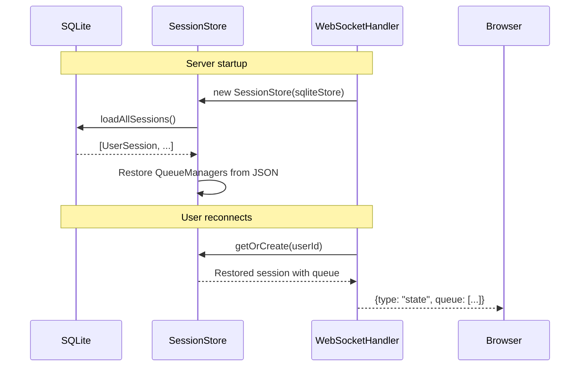
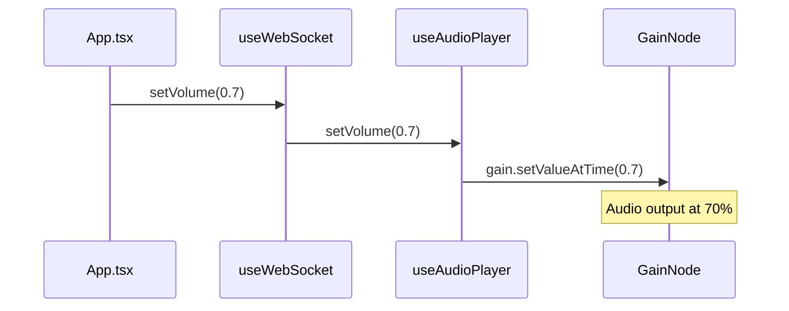
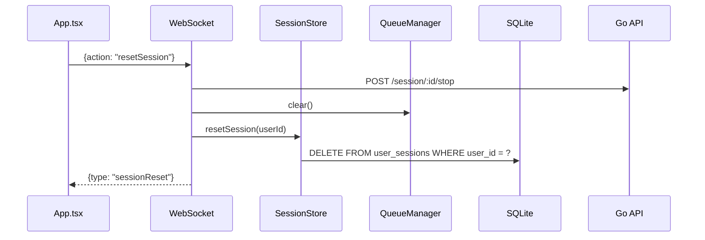

# Web Player Polish - Implementation Plan

## Overview

- **Goal**: Add SQLite persistence, volume control, and full reset to web player
- **Scope**: Node.js backend + React frontend only. No Go changes.
- **Affected Layers**: Node.js (c3-103, c3-107), React (playground)
- **Story Reference**: `docs/stories/2026-02-06-web-player-polish.md`

## Command Flow

### Persistence Flow (Server Start)



### Volume Control Flow (Browser-only)



### Reset Session Flow



## Implementation Phases

### Phase 1: SQLite Infrastructure (Node.js)

| Order | Task | File | Description |
|-------|------|------|-------------|
| 1.1 | Add better-sqlite3 dependency | `app/package.json` | `npm install better-sqlite3 @types/better-sqlite3` |
| 1.2 | Create SQLite store module | `app/src/sqlite-store.ts` (NEW) | Database wrapper with CRUD operations |
| 1.3 | Initialize DB on startup | `app/src/index.ts` | Call `sqliteStore.init()` before WebSocket setup |

**Task 1.2 Details - sqlite-store.ts:**
```typescript
// Functions to implement:
export class SqliteStore {
  init(): void                           // Create table if not exists
  saveSession(session: SessionData): void // INSERT OR REPLACE
  loadSession(userId: string): SessionData | null
  deleteSession(userId: string): void
  loadAllSessions(): SessionData[]
}

interface SessionData {
  userId: string;
  username: string;
  avatar: string | null;
  queue: Track[];           // Serialized to JSON
  currentIndex: number;
  isPaused: boolean;
  playbackOffsetSec: number;
}
```

### Phase 2: Session Store Integration (Node.js)

| Order | Task | File | Description |
|-------|------|------|-------------|
| 2.1 | Add SqliteStore to SessionStore | `app/src/session-store.ts` | Inject via constructor |
| 2.2 | Load sessions on creation | `app/src/session-store.ts` | Restore from DB in constructor |
| 2.3 | Add persist() method | `app/src/session-store.ts` | Save session to SQLite |
| 2.4 | Debounce persist calls | `app/src/session-store.ts` | 100ms debounce to avoid write spam |

**Task 2.1-2.4 Changes:**
```typescript
// session-store.ts changes
export class SessionStore {
  private sqliteStore: SqliteStore;
  private persistTimers = new Map<string, NodeJS.Timeout>();

  constructor(sqliteStore: SqliteStore) {
    this.sqliteStore = sqliteStore;
    this.restoreFromDb();
  }

  private restoreFromDb(): void {
    const sessions = this.sqliteStore.loadAllSessions();
    for (const data of sessions) {
      // Restore QueueManager from data.queue
    }
  }

  persist(userId: string): void {
    // Debounce: clear existing timer, set new 100ms timer
    // On fire: call sqliteStore.saveSession()
  }

  resetSession(userId: string): void {
    // Clear queue, reset state, delete from DB
  }
}
```

### Phase 3: Queue Manager Persistence Hooks (Node.js)

| Order | Task | File | Description |
|-------|------|------|-------------|
| 3.1 | Emit 'persist' event on changes | `app/src/queue-manager.ts` | After every state change |
| 3.2 | Listen for 'persist' in SessionStore | `app/src/session-store.ts` | Call persist() when queue changes |

**Task 3.1 Changes:**
```typescript
// queue-manager.ts - add to emitUpdate()
private emitUpdate(): void {
  this.emit('update', this.getState());
  this.emit('persist'); // NEW: trigger persistence
}
```

### Phase 4: WebSocket Handler Updates (Node.js)

| Order | Task | File | Description |
|-------|------|------|-------------|
| 4.1 | Add resetSession action handler | `app/src/websocket.ts` | New action type |
| 4.2 | Wire up persistence on queue events | `app/src/websocket.ts` | Listen to QueueManager 'persist' event |

**Task 4.1 Changes:**
```typescript
// websocket.ts - add to handleBrowserMessage()
} else if (message.action === 'resetSession') {
  // Stop current playback if any
  if (session.currentSessionId) {
    await this.apiClient.stop(session.currentSessionId);
  }
  // Reset all state
  this.resetPlaybackState(session);
  session.queueManager.clear();
  // Delete from persistence
  this.sessionStore.resetSession(session.userId);
  // Notify client
  this.broadcastJsonToUser(session.userId, { type: 'sessionReset' });
}
```

### Phase 5: Volume Control (React)

| Order | Task | File | Description |
|-------|------|------|-------------|
| 5.1 | Add GainNode to audio pipeline | `playground/src/hooks/useAudioPlayer.ts` | Create in init(), route audio through it |
| 5.2 | Export setVolume function | `playground/src/hooks/useAudioPlayer.ts` | Smooth gain transition |
| 5.3 | Add volume state to useWebSocket | `playground/src/hooks/useWebSocket.ts` | Local state, default 1.0 |
| 5.4 | Wire setVolume to audioPlayer | `playground/src/hooks/useWebSocket.ts` | Call audioPlayer.setVolume on change |

**Task 5.1-5.2 Changes (useAudioPlayer.ts):**
```typescript
// Add GainNode
const gainNodeRef = useRef<GainNode | null>(null);

const init = useCallback(async () => {
  // ... existing init code ...
  gainNodeRef.current = audioContextRef.current.createGain();
  gainNodeRef.current.connect(audioContextRef.current.destination);
}, []);

// In scheduleBuffers: change destination
source.connect(gainNodeRef.current!); // Was: audioContext.destination

// New export
const setVolume = useCallback((value: number) => {
  if (gainNodeRef.current && audioContextRef.current) {
    const clampedValue = Math.max(0, Math.min(1, value));
    // Smooth transition to avoid clicks
    gainNodeRef.current.gain.setTargetAtTime(
      clampedValue,
      audioContextRef.current.currentTime,
      0.01 // 10ms time constant
    );
  }
}, []);

return { init, playChunk, reset, stop, isInitialized, setVolume };
```

### Phase 6: UI Updates (React)

| Order | Task | File | Description |
|-------|------|------|-------------|
| 6.1 | Add resetSession to useWebSocket | `playground/src/hooks/useWebSocket.ts` | Send WebSocket action |
| 6.2 | Add volume slider to App.tsx | `playground/src/App.tsx` | In controls area, horizontal slider |
| 6.3 | Add reset button to App.tsx | `playground/src/App.tsx` | Near queue header, destructive styling |
| 6.4 | Handle sessionReset event | `playground/src/hooks/useWebSocket.ts` | Reset local state |

**Task 6.2-6.3 UI Placement:**
```tsx
// Volume slider - in controls section after play/pause/skip buttons
<div className="flex items-center gap-2 ml-4">
  <Volume2 size={18} className="text-slate-400" />
  <input
    type="range"
    min="0"
    max="1"
    step="0.01"
    value={volume}
    onChange={(e) => setVolume(parseFloat(e.target.value))}
    className="w-24 accent-indigo-500"
  />
</div>

// Reset button - in queue header, next to clear button
<button
  onClick={resetSession}
  className="p-1.5 text-slate-500 hover:text-orange-400 hover:bg-orange-500/10 rounded-md transition-all"
  title="Reset Session"
>
  <RotateCcw size={14} />
</button>
```

## File Change Summary

### New Files

| File | Purpose |
|------|---------|
| `app/src/sqlite-store.ts` | SQLite database wrapper |

### Modified Files

| File | Changes |
|------|---------|
| `app/package.json` | Add `better-sqlite3` dependency |
| `app/src/index.ts` | Initialize SqliteStore |
| `app/src/session-store.ts` | Add persistence, restore, reset |
| `app/src/queue-manager.ts` | Emit 'persist' event |
| `app/src/websocket.ts` | Add resetSession action |
| `playground/src/hooks/useAudioPlayer.ts` | Add GainNode + setVolume |
| `playground/src/hooks/useWebSocket.ts` | Add volume state + resetSession |
| `playground/src/App.tsx` | Add volume slider + reset button |

## Checklist

- [ ] `better-sqlite3` added to package.json
- [ ] SQLite store created and tested
- [ ] SessionStore loads sessions on startup
- [ ] SessionStore persists on queue changes (debounced)
- [ ] resetSession action works end-to-end
- [ ] Volume slider changes audio output smoothly
- [ ] Reset button clears queue and stops playback
- [ ] Server restart restores queue state
- [ ] Discord bot flow unchanged (no regressions)
- [ ] Audio quality verified (48kHz, 20ms frames)
- [ ] No changes to useAudioPlayer buffering/jitter logic
