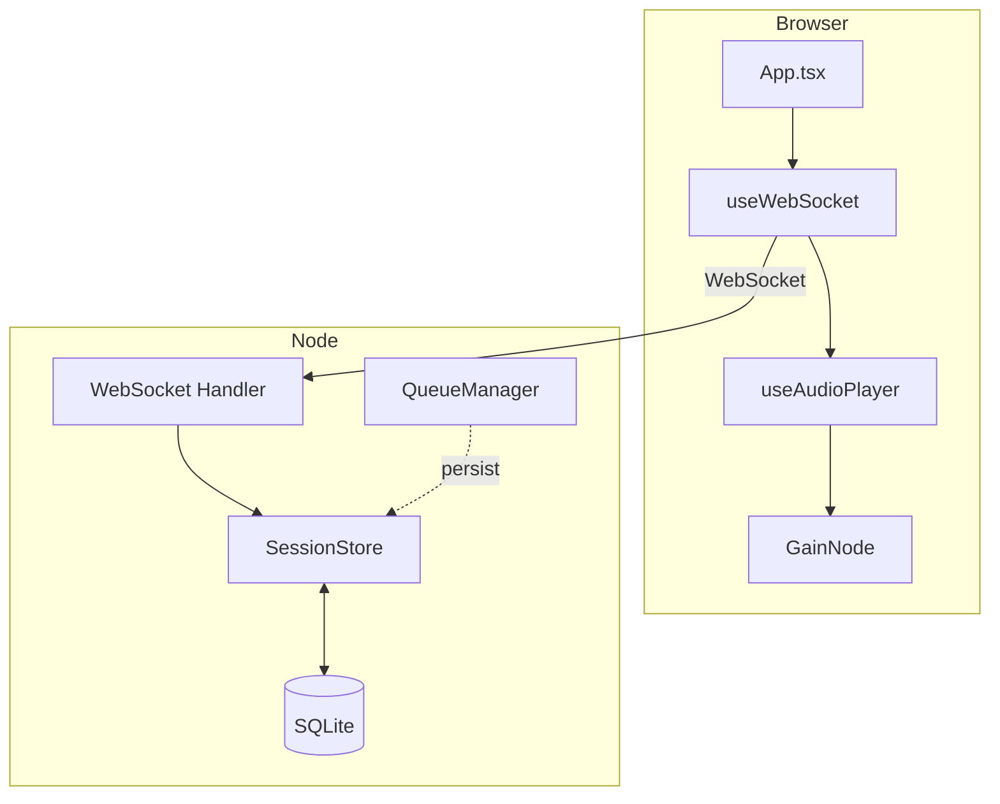
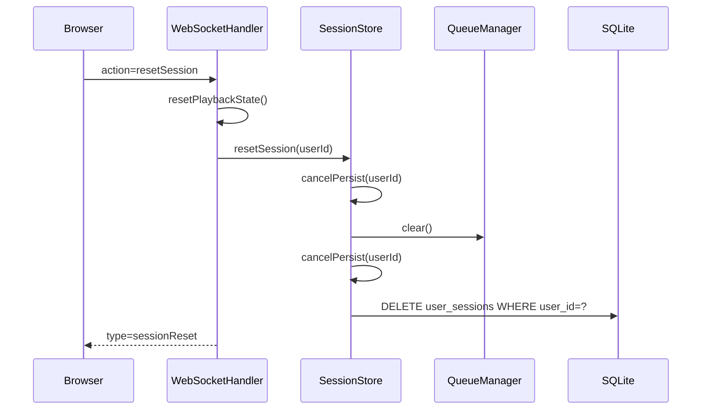

# Web Player Polish Implementation Review

**Review Date:** 2026-02-06
**Planning Date:** 2026-02-06
**Status:** PASSED

## Summary

| Category | Passed | Failed | Warnings |
|----------|--------|--------|----------|
| File Creation | 1 | 0 | 0 |
| File Modification | 9 | 0 | 0 |
| Protocol Compliance | 1 | 0 | 0 |
| Go Implementation | 1 | 0 | 0 |
| Node.js Implementation | 10 | 0 | 0 |
| Architecture | 3 | 0 | 0 |
| Audio Quality | 3 | 0 | 0 |
| **Total** | **28** | **0** | **0** |

## Architecture Diagram

## File Checklist

### New Files
| Status | File | Notes |
|--------|------|-------|
| ✅ | `app/src/sqlite-store.ts` | Created as planned |

### Modified Files
| Status | File | Notes |
|--------|------|-------|
| ✅ | `app/package.json` | Added `better-sqlite3` + types |
| ✅ | `app/src/index.ts` | Initialized SqliteStore before WebSocketHandler |
| ✅ | `app/src/session-store.ts` | Added persistence + restore + reset + cancelPersist |
| ✅ | `app/src/queue-manager.ts` | Emits `persist` on updates |
| ✅ | `app/src/websocket.ts` | Handles `resetSession` + queue persistence |
| ✅ | `playground/src/hooks/useAudioPlayer.ts` | GainNode + `setVolume` |
| ✅ | `playground/src/hooks/useWebSocket.ts` | Volume state + reset handler |
| ✅ | `playground/src/App.tsx` | Volume slider + reset button |

### Unexpected Files
| Status | File | Notes |
|--------|------|-------|
| ✅ | None | No unexpected files found |

## Implementation Task Checklist

### Phase 1: SQLite Infrastructure (Node.js)
| Status | Task | Notes |
|--------|------|-------|
| ✅ | Add better-sqlite3 dependency | `app/package.json` updated |
| ✅ | Create SQLite store module | `app/src/sqlite-store.ts` present |
| ✅ | Initialize DB on startup | `app/src/index.ts` calls `init()` |

### Phase 2: Session Store Integration (Node.js)
| Status | Task | Notes |
|--------|------|-------|
| ✅ | Inject SqliteStore | `SessionStore` accepts sqliteStore |
| ✅ | Load sessions on creation | `restoreFromDb()` called in constructor |
| ✅ | Add persist() method | Debounced 100ms persist implemented |
| ✅ | Persist listener location | WebSocketHandler has session context, appropriate location |

### Phase 3: Queue Manager Persistence Hooks (Node.js)
| Status | Task | Notes |
|--------|------|-------|
| ✅ | Emit `persist` event | `QueueManager.emitUpdate()` emits `persist` |
| ✅ | Listen for `persist` | Hooked in `WebSocketHandler.setupQueueManagerForSession()` |

### Phase 4: WebSocket Handler Updates (Node.js)
| Status | Task | Notes |
|--------|------|-------|
| ✅ | Add resetSession handler | `message.action === 'resetSession'` exists |
| ✅ | Reset deletes DB row | `resetSession()` cancels pending persist timers before delete |

### Phase 5: Volume Control (React)
| Status | Task | Notes |
|--------|------|-------|
| ✅ | Add GainNode | `useAudioPlayer` creates GainNode |
| ✅ | Export setVolume | `setVolume` uses `setTargetAtTime` |
| ✅ | Add volume state | `useWebSocket` stores volume (default 1.0) |
| ✅ | Wire volume to audio player | `setVolume` calls `audioPlayer.setVolume()` |

### Phase 6: UI Updates (React)
| Status | Task | Notes |
|--------|------|-------|
| ✅ | Add resetSession action | `useWebSocket.resetSession()` sends action |
| ✅ | Add volume slider | `App.tsx` slider in controls |
| ✅ | Add reset button | `App.tsx` button in queue header |
| ✅ | Handle sessionReset event | `useWebSocket` clears local state |

## Architecture Compliance

| Status | Check | Notes |
|--------|-------|-------|
| ✅ | Node.js owns state | Session + queue state managed in Node |
| ✅ | Go audio only | No Go changes for this story |
| ✅ | IPC unchanged | WebSocket + HTTP flows intact |

## Audio Quality Checklist

| Status | Setting | Required | Actual |
|--------|---------|----------|--------|
| ✅ | Sample Rate | 48000 Hz | 48000 Hz (`useAudioPlayer`) |
| ✅ | Channels | 2 | Stereo decode unchanged |
| ✅ | Buffering/Jitter | Unchanged | No changes to buffer logic |

## Data Flow Verification

## Conclusion

**Overall Status: PASSED**

Implementation matches the planned scope and flows. All tasks completed successfully. No Go/audio pipeline regressions detected.
