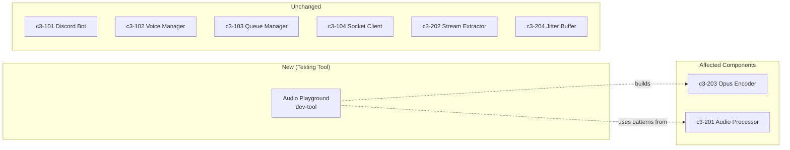
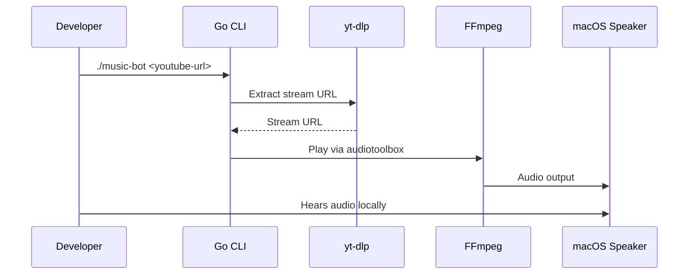
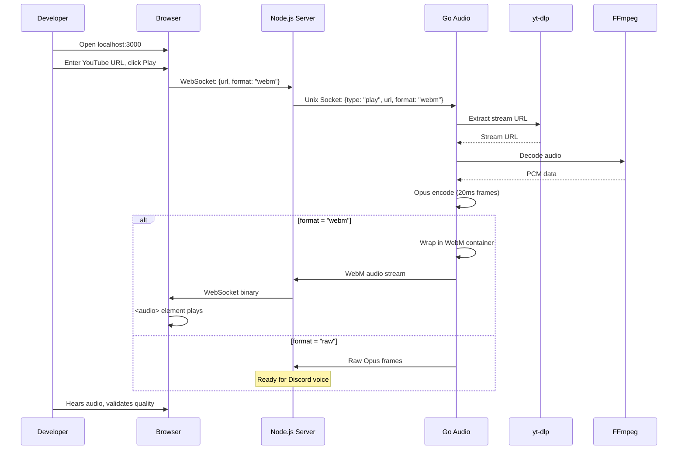

# Audio Test Playground

Build a web-based audio testing tool to validate the Opus encoding pipeline before Discord integration.

## C3 Components Affected



| Component | Layer | Change Type |
|-----------|-------|-------------|
| c3-203 Opus Encoder | Go | **Create** (core of this story) |
| c3-201 Audio Processor | Go | **Create** (socket server, minimal) |
| dev-tool/playground | Both | **Create** (new testing tool) |
| c3-104 Socket Client | Node.js | None (patterns reused later) |

## User Intent

- **User**: Developer (you)
- **Goal**: Hear audio output in browser to validate quality before Discord integration
- **Why now**: Need to verify Opus encoding works correctly before building full pipeline

## Support Provided

- **Will do**: Design flexible Opus layer, create web playground, enable format switching
- **Won't do**: Full Discord integration, queue management, jitter buffer (future stories)

## Current Flow



- Entry point: CLI command `./music-bot <url>`
- FFmpeg outputs directly to macOS AudioToolbox
- No IPC, no encoding pipeline, no web interface

## Repo Evidence

| File | What it shows |
|------|---------------|
| `main.go:86-94` | FFmpeg player called directly, no socket |
| `internal/player/ffmpeg/ffmpeg.go:74-98` | Platform-specific audio output (audiotoolbox on macOS) |
| `internal/platform/youtube/youtube.go` | yt-dlp extraction works |
| `.c3/c3-2-go-audio/README.md:127-150` | Planned IPC protocol (not implemented) |

**Unknown:**
- Opus encoding not implemented yet
- Socket server not implemented yet
- Node.js layer doesn't exist

## Problem Statement

- Cannot test audio quality in browser
- Cannot verify Opus encoding matches Discord requirements (48kHz, 20ms frames)
- No way to validate pipeline before Discord integration
- Current FFmpeg player outputs to local device only

## Proposed Solution



### Architecture

```
┌─────────────────────────────────────────────────────────────────┐
│                        Go Audio Server                          │
│  ┌──────────────┐    ┌──────────────┐    ┌──────────────────┐  │
│  │ yt-dlp       │───▶│ FFmpeg       │───▶│ Opus Encoder     │  │
│  │ (extract)    │    │ (decode)     │    │ (20ms frames)    │  │
│  └──────────────┘    └──────────────┘    └────────┬─────────┘  │
│                                                    │            │
│                                          ┌────────▼─────────┐  │
│                                          │ Output Formatter │  │
│                                          │ (flag-based)     │  │
│                                          └────────┬─────────┘  │
│                                                    │            │
│                              ┌─────────────────────┼────────┐  │
│                              │                     │        │  │
│                        format="raw"          format="webm"  │  │
│                              │                     │        │  │
│                              ▼                     ▼        │  │
│                     ┌──────────────┐      ┌─────────────┐   │  │
│                     │ Raw Opus     │      │ WebM Muxer  │   │  │
│                     │ Frames       │      │ Container   │   │  │
│                     └──────┬───────┘      └──────┬──────┘   │  │
│                            │                     │          │  │
└────────────────────────────┼─────────────────────┼──────────┘  │
                             │                     │
              Unix Socket ───┴─────────────────────┘
                             │
┌────────────────────────────▼────────────────────────────────┐
│                     Node.js Server                          │
│  ┌──────────────┐    ┌──────────────┐    ┌──────────────┐  │
│  │ Socket       │───▶│ Express      │───▶│ WebSocket    │  │
│  │ Client       │    │ Server       │    │ Broadcast    │  │
│  └──────────────┘    └──────────────┘    └──────────────┘  │
└────────────────────────────┬────────────────────────────────┘
                             │
                        WebSocket
                             │
┌────────────────────────────▼────────────────────────────────┐
│                        Browser                              │
│  ┌────────────────────────────────────────────────────────┐│
│  │  [___YouTube URL___________]  [▶ Play] [■ Stop]       ││
│  │                                                        ││
│  │  <audio controls />                                    ││
│  └────────────────────────────────────────────────────────┘│
└─────────────────────────────────────────────────────────────┘
```

### IPC Protocol

**Command (Node.js → Go):**
```json
{"type": "play", "session_id": "abc123", "url": "https://youtube.com/...", "format": "webm"}
{"type": "play", "session_id": "abc123", "url": "https://youtube.com/...", "format": "raw"}
{"type": "stop", "session_id": "abc123"}
```

**Events (Go → Node.js):**
```json
{"type": "ready", "session_id": "abc123", "duration": 240}
{"type": "error", "session_id": "abc123", "message": "extraction failed"}
{"type": "finished", "session_id": "abc123"}
```

**Audio (Go → Node.js):**
- Format `webm`: Binary WebM stream (playable in browser)
- Format `raw`: Binary Opus frames `[session_id:8][sequence:4][opus_data:variable]`

### Behavior Changes

- Go: Add Unix socket server listening on `/tmp/music-playground.sock`
- Go: Add Opus encoder (FFmpeg pipe → libopus or FFmpeg opus output)
- Go: Add output formatter with `format` flag support
- Node.js: Create Express server with static HTML
- Node.js: Create WebSocket server for browser communication
- Node.js: Create Unix socket client to communicate with Go
- Browser: Simple HTML page with URL input, Play/Stop, audio element

### Error Handling

| Error | Handling |
|-------|----------|
| Invalid URL | Go returns `{"type": "error", "message": "invalid url"}` |
| yt-dlp fails | Go returns `{"type": "error", "message": "extraction failed: ..."}` |
| FFmpeg fails | Go returns `{"type": "error", "message": "encoding failed: ..."}` |
| Socket disconnected | Node.js logs error, browser shows "Disconnected" |

## Alternatives Considered

### 1. Raw PCM streaming (simpler, less fidelity)
- **Pros**: No Opus encoding needed, Web Audio API plays PCM directly
- **Cons**: Doesn't test actual Discord codec, high bandwidth
- **Rejected**: Doesn't validate what we actually need

### 2. Full c3-201/c3-203 implementation first
- **Pros**: Production-ready components
- **Cons**: Too much scope, need worker pool, jitter buffer
- **Rejected**: Over-engineering for testing purposes

### 3. Chosen: Minimal Opus layer with format flag
- **Pros**: Tests real codec, reusable for Discord, minimal scope
- **Cons**: None significant
- **Selected**: Right balance of fidelity and simplicity

## Acceptance Criteria

- [ ] Go server accepts play command via Unix socket
- [ ] Go extracts YouTube URL and decodes audio via FFmpeg
- [ ] Go encodes to Opus (48kHz stereo, 20ms frames, 128kbps)
- [ ] When `format=webm`, Go outputs Opus in WebM container
- [ ] When `format=raw`, Go outputs raw Opus frames
- [ ] Node.js receives audio stream from Go
- [ ] Node.js serves web UI on `localhost:3000`
- [ ] Browser can play WebM audio stream
- [ ] Play/Stop controls work
- [ ] Audio quality is clear (no artifacts, dropouts)

## Implementation Plan

### Go Tasks

| Task | Description | Files |
|------|-------------|-------|
| G1 | Create Unix socket server (listen, accept, read commands) | `internal/server/socket.go` |
| G2 | Create command handler (parse JSON, dispatch) | `internal/server/handler.go` |
| G3 | Create Opus encoder (FFmpeg → Opus frames) | `internal/encoder/opus.go` |
| G4 | Create WebM muxer (wrap Opus in WebM container) | `internal/encoder/webm.go` |
| G5 | Create session manager (track active playback) | `internal/server/session.go` |
| G6 | Wire up: socket → handler → extractor → encoder → output | `cmd/server/main.go` |

### Node.js Tasks

| Task | Description | Files |
|------|-------------|-------|
| N1 | Create project structure (package.json, tsconfig) | `playground/package.json` |
| N2 | Create Unix socket client (connect to Go) | `playground/src/socket-client.ts` |
| N3 | Create Express server (serve static files) | `playground/src/server.ts` |
| N4 | Create WebSocket handler (browser ↔ Node.js) | `playground/src/websocket.ts` |
| N5 | Create web UI (HTML + minimal JS) | `playground/public/index.html` |

### Integration Tasks

| Task | Description |
|------|-------------|
| I1 | Test Go server standalone (send commands via `nc`) |
| I2 | Test Node.js ↔ Go socket communication |
| I3 | Test end-to-end: browser → Node.js → Go → audio playback |

## Testing Plan

### Manual QA

1. Start Go server: `go run cmd/server/main.go`
2. Start Node.js: `cd playground && npm start`
3. Open `http://localhost:3000`
4. Paste YouTube URL
5. Click Play → should hear audio
6. Click Stop → audio stops
7. Verify: no crackling, no dropouts, clear quality

### Unit Tests

| Test | What |
|------|------|
| `opus_test.go` | Opus encoder produces valid 20ms frames |
| `webm_test.go` | WebM muxer produces playable output |
| `handler_test.go` | Command parsing works correctly |

### Audio Quality Verification

- [ ] Sample rate: 48000 Hz (use `ffprobe` on output)
- [ ] Channels: 2 (stereo)
- [ ] Frame size: 20ms (960 samples)
- [ ] Bitrate: ~128kbps
- [ ] No audible artifacts

## Risks & Open Questions

### Risks

| Risk | Mitigation |
|------|------------|
| WebM muxing complexity | Use FFmpeg's webm muxer, not manual |
| Browser MediaSource buffering | Start with simple `<audio src>` blob URL |
| Latency in socket chain | Acceptable for testing, optimize later |

### Open Questions

- Should we use FFmpeg's built-in Opus encoder or libopus directly?
  → **Decision**: FFmpeg opus (simpler, already a dependency)
- Single socket or separate command/audio sockets?
  → **Decision**: Single socket for playground simplicity (production uses two)

## Out of Scope

- Worker pool (c3-201 full implementation)
- Jitter buffer (c3-204)
- Queue management (c3-103)
- Discord integration (c3-101, c3-102)
- Pause/Resume controls
- Volume control
- Multiple concurrent sessions
- Production error recovery
- Caching extracted URLs

## Follow-ups

After this story:
1. **c3-201 Audio Processor**: Full worker pool, multi-session
2. **c3-204 Jitter Buffer**: Frame smoothing for Discord
3. **c3-104 Socket Client**: Production IPC for Discord bot
