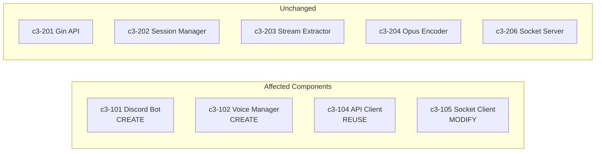
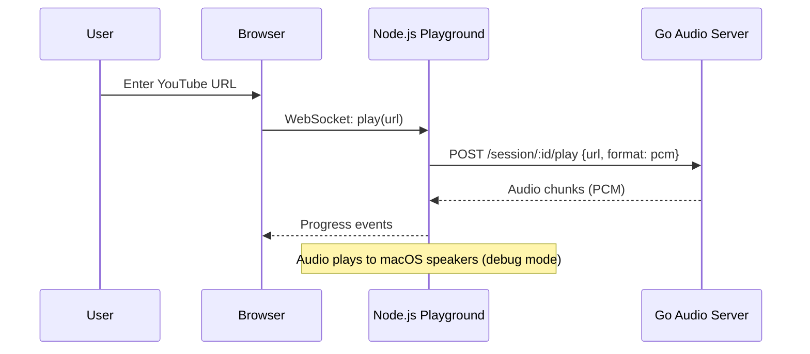
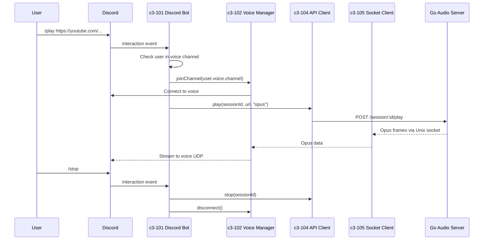

# Discord Bot: /play and /stop Commands

## Title

Add `/play` and `/stop` slash commands to play YouTube audio in Discord voice channel

## C3 Components Affected



| Component | Layer | Change Type |
|-----------|-------|-------------|
| c3-101 Discord Bot | Node.js | **CREATE** |
| c3-102 Voice Manager | Node.js | **CREATE** |
| c3-104 API Client | Node.js | REUSE from playground |
| c3-105 Socket Client | Node.js | MODIFY for Opus streaming |
| c3-201 to c3-206 | Go | None (already supports Opus) |

## User intent (what user wants)

- **User**: Discord server member in a voice channel
- **Goal**: Play YouTube audio in their voice channel using slash commands
- **Why now**: Core functionality needed to validate the audio pipeline works end-to-end with Discord

## Support needed (what I, the agent, will provide)

- What I will do:
  - Analyze existing playground code for reusable patterns
  - Design minimal Discord bot structure
  - Produce implementation tasks
  - List risks and dependencies

- What I will NOT do:
  - Queue management (follow-up story)
  - Multiple guild support (follow-up story)
  - Error recovery/reconnection logic (follow-up story)

## How the user uses this (current flow)

**Current**: No Discord bot exists. User can only test via browser playground.



## Repo evidence (NO assumptions)

- `playground/src/api-client.ts` — HTTP client to Go API (reusable)
- `playground/src/socket-client.ts` — Unix socket receiver (needs Opus adaptation)
- `playground/src/queue-manager.ts` — Queue logic (NOT used in this story)
- `internal/encoder/ffmpeg.go:153-158` — Opus encoding implemented
- `internal/server/session.go:111-112` — Format "opus" supported
- `playground/package.json` — No discord.js (need to add)
- No `node/` directory exists yet

**Go Opus output format** (from `internal/encoder/ffmpeg.go`):
```go
case FormatOpus:
    "-c:a", "libopus",
    "-ar", "48000",
    "-f", "opus",
```

## Problem statement (what's wrong / missing)

- No Discord bot exists
- Cannot play audio in Discord voice channels
- The Go audio server is ready (Opus support) but no Discord integration

## Proposed solution (recommended)



### Behavior

1. **`/play <url>`**:
   - Check user is in a voice channel → error if not
   - If already playing → stop current session first
   - Join user's voice channel
   - Start playback with `format: opus`
   - Stream Opus frames to Discord voice

2. **`/stop`**:
   - Stop current session (call Go API)
   - Disconnect from voice channel
   - Clean up resources

### File structure (new `node/` directory)

```
node/
├── package.json          # discord.js, @discordjs/voice
├── tsconfig.json
├── src/
│   ├── index.ts          # Entry point, bot login
│   ├── commands/
│   │   ├── play.ts       # /play command handler
│   │   └── stop.ts       # /stop command handler
│   ├── voice/
│   │   └── manager.ts    # c3-102: Voice connection manager
│   ├── audio/
│   │   ├── api-client.ts # c3-104: Copy/adapt from playground
│   │   └── socket-client.ts # c3-105: Adapt for Opus
│   └── config.ts         # Bot token, guild ID
└── .env                  # BOT_TOKEN, GUILD_ID (gitignored)
```

### Key dependencies

```json
{
  "dependencies": {
    "discord.js": "^14.14.1",
    "@discordjs/voice": "^0.17.0",
    "@discordjs/opus": "^0.9.0",
    "sodium-native": "^4.0.0"
  }
}
```

### Audio Format: OGG/Opus Container

**Go outputs OGG/Opus container** (not raw frames):
```go
// internal/encoder/ffmpeg.go:153-159
"-c:a", "libopus",
"-b:a", "128000",
"-f", "opus",    // OGG/Opus container format
"pipe:1",
```

**Discord.js StreamType options:**

| StreamType | Format | Processing | Performance |
|------------|--------|-----------|-------------|
| `StreamType.OggOpus` | OGG container with Opus | Demux only | Good |
| `StreamType.Opus` | Raw Opus packets | None | Best |
| `StreamType.Arbitrary` | Unknown | FFmpeg transcode | Worst |

**Decision: Use `StreamType.OggOpus`**
- Go already outputs OGG/Opus → no Go changes needed
- Discord.js demuxes efficiently (no FFmpeg transcoding)
- Stable, well-supported path

### Voice streaming approach

Use `@discordjs/voice` with OGG/Opus stream:

```typescript
// Simplified flow
const connection = joinVoiceChannel({ channelId, guildId, ... });
const player = createAudioPlayer();
connection.subscribe(player);

// Socket receives OGG/Opus from Go, pipe to Discord
const resource = createAudioResource(socketStream, {
  inputType: StreamType.OggOpus  // discord.js demuxes automatically
});
player.play(resource);
```

## Alternatives considered

1. **Extend playground instead of new `node/` directory**
   - Pros: Faster to start, shared deps
   - Cons: Mixes test UI with production bot, messy separation
   - **Rejected**: User wants clean separation

2. **Use PCM instead of Opus**
   - Pros: Simpler (no Opus handling in Node.js)
   - Cons: Higher bandwidth, need to encode in Node.js
   - **Rejected**: Go already outputs Opus, Discord needs Opus

3. **Use Lavalink instead of custom Go server**
   - Pros: Mature, battle-tested
   - Cons: Defeats the purpose of this project (learning, custom control)
   - **Rejected**: Project goal is custom implementation

## Acceptance criteria (must be testable)

- [ ] `/play <youtube-url>` joins user's voice channel and plays audio
- [ ] Audio quality: 48kHz stereo Opus, no crackling/lag
- [ ] `/stop` stops playback and disconnects bot from voice
- [ ] `/play` while playing stops current and plays new track
- [ ] `/play` when user not in voice channel returns error message
- [ ] Bot handles invalid YouTube URLs gracefully (error message)
- [ ] No regression in Go audio server (playground still works)

## Implementation plan (tasks)

### Setup Tasks
- **Task S1**: Create `node/` directory with package.json, tsconfig.json
- **Task S2**: Add discord.js, @discordjs/voice, @discordjs/opus dependencies
- **Task S3**: Create `.env` file structure and config.ts for bot token

### Node.js Tasks (c3-101 Discord Bot)
- **Task N1**: Create `index.ts` - bot login, slash command registration
- **Task N2**: Create `commands/play.ts` - /play command handler
- **Task N3**: Create `commands/stop.ts` - /stop command handler

### Node.js Tasks (c3-102 Voice Manager)
- **Task N4**: Create `voice/manager.ts` - join/leave voice channel
- **Task N5**: Implement AudioPlayer integration with @discordjs/voice

### Node.js Tasks (c3-104, c3-105 - Reuse/Adapt)
- **Task N6**: Copy and adapt `api-client.ts` from playground
- **Task N7**: Adapt `socket-client.ts` for Opus frame handling
- **Task N8**: Create Opus stream bridge (socket → AudioResource)

### Integration Tasks
- **Task I1**: Wire up: command → voice manager → api client → socket → player
- **Task I2**: Add to Taskfile.yml: `task bot:dev` command
- **Task I3**: End-to-end test in Discord

## Testing plan

- **Unit tests**: Not in this story (minimal MVP)
- **Integration test**:
  - Start Go server
  - Start Discord bot
  - Join voice channel
  - Run `/play` with YouTube URL
  - Verify audio plays in voice channel
  - Run `/stop`
  - Verify bot disconnects
- **Audio quality check**:
  - No crackling
  - No lag/stuttering
  - Clear stereo sound

## Risks & open questions

**Risks:**
- Socket buffering: May need to buffer stream before sending to voice
- `@discordjs/opus` native dependency: May have build issues on some systems
- OGG demuxing overhead: Minimal, but monitor for latency

**Resolved questions:**
- ~~Which voice channel to join?~~ → User's current channel
- ~~Queue behavior?~~ → No queue, stop & play new
- ~~Opus format compatibility?~~ → Go outputs OGG/Opus, use `StreamType.OggOpus` in discord.js

## Out of scope

- Queue management (`/skip`, `/queue`, `/previous`)
- Pause/resume commands
- Multiple guild support
- Now playing embed
- Error recovery/auto-reconnect
- Volume control
- Playlist support (already in Go, but not exposed to Discord)

These will be separate follow-up stories.
