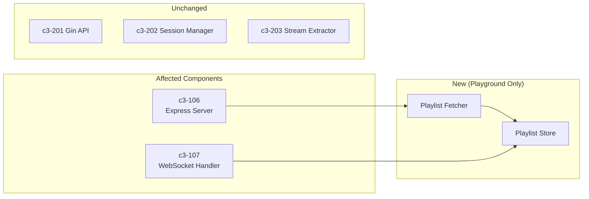
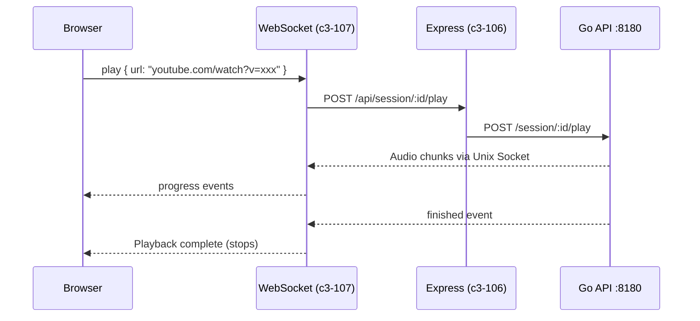
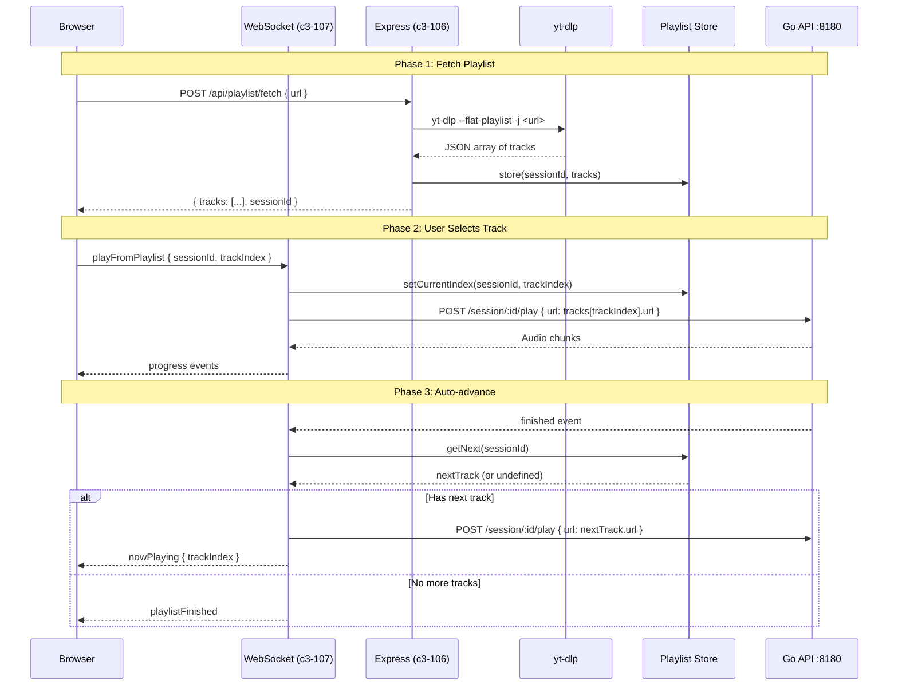

# Add YouTube Playlist Support to WebUI Playground

## C3 Components Affected



| Component | Layer | Change Type |
|-----------|-------|-------------|
| c3-106 Express Server | Node.js | Modify - add playlist endpoint |
| c3-107 WebSocket Handler | Node.js | Modify - playlist state, auto-advance |
| Playlist Fetcher | Node.js | Create - new module (playground only) |
| Playlist Store | Node.js | Create - new module (playground only) |
| React WebUI | Client | Modify - playlist display, track selection |

## User Intent

- **User**: Developer testing via WebUI playground
- **Goal**: Paste a YouTube playlist URL, see all tracks, click any track to play it, and have remaining tracks auto-play in sequence
- **Why now**: Validate playlist/queue flow before implementing full Discord integration (c3-103 Queue Manager)

## Support Provided

- Analyze existing codebase patterns
- Design minimal implementation that fits existing architecture
- Produce implementation tasks with file locations
- Identify risks and edge cases

## Current Flow (Single Video Only)



**Current behavior:**
- User pastes single YouTube video URL
- Clicks Play button
- One video plays
- When finished, playback stops
- No playlist support whatsoever

## Repo Evidence

| File | What it shows |
|------|---------------|
| `playground/client/src/App.tsx:70-84` | Single URL input field, single Play button |
| `playground/client/src/hooks/useWebSocket.ts:231-248` | `play()` sends single URL via WebSocket |
| `playground/src/websocket.ts` | Handles `play` action, calls Go API, no queue logic |
| `playground/src/server.ts:25-42` | `/api/session/:id/play` proxies single URL to Go |
| `internal/platform/youtube/youtube.go:32` | `--no-playlist` flag - explicitly ignores playlists |

**Unknown:**
- How yt-dlp `--flat-playlist` output looks (need to verify format)

**Need:** Test `yt-dlp --flat-playlist -j <playlist-url>` output format

## Problem Statement

- Users cannot play YouTube playlists
- No way to see track list before playing
- No auto-advance between tracks
- Must manually copy-paste each video URL

## Proposed Solution



### Behavior Changes

1. **New input mode**: User can paste playlist URL (detected by `list=` in URL)
2. **Fetch playlist**: Node.js calls yt-dlp to get track metadata (title, URL, duration)
3. **Display track list**: React shows scrollable list of tracks with titles
4. **Click to play**: Clicking track plays it and queues remaining tracks
5. **Auto-advance**: When track finishes, automatically play next queued track
6. **Now playing indicator**: UI highlights currently playing track

### File Changes

```
playground/src/
├── playlist-fetcher.ts   # NEW: yt-dlp --flat-playlist wrapper
├── playlist-store.ts     # NEW: In-memory Map<sessionId, PlaylistState>
├── server.ts             # MODIFY: Add POST /api/playlist/fetch
└── websocket.ts          # MODIFY: Handle playFromPlaylist, auto-advance on finish

playground/client/src/
├── App.tsx               # MODIFY: Conditional playlist vs single-video UI
├── components/
│   └── PlaylistView.tsx  # NEW: Track list component
└── hooks/
    └── useWebSocket.ts   # MODIFY: Add playlist state, fetchPlaylist, playFromPlaylist
```

### Data Types

```typescript
// playlist-fetcher.ts
interface PlaylistTrack {
  id: string;           // YouTube video ID
  url: string;          // Full YouTube URL
  title: string;        // Video title
  duration: number;     // Duration in seconds (may be null for some videos)
}

interface PlaylistInfo {
  id: string;           // Playlist ID
  title: string;        // Playlist title
  tracks: PlaylistTrack[];
}

// playlist-store.ts
interface PlaylistState {
  info: PlaylistInfo;
  currentIndex: number;
  sessionId: string;
}
```

### Edge Cases

| Case | Handling |
|------|----------|
| Invalid playlist URL | Return error, show message |
| Private/unavailable videos | yt-dlp skips them, show count of skipped |
| Empty playlist | Return error "Playlist is empty" |
| Very long playlist (100+ tracks) | Fetch all, paginate UI display |
| User clicks track while another plays | Stop current, start new |
| Network error during fetch | Return error, allow retry |
| yt-dlp not installed | Return error with install instructions |

### Backwards Compatibility

- Single video URLs still work exactly as before
- Playlist detection is additive (check for `list=` parameter)
- Existing session/play endpoints unchanged

## Alternatives Considered

### Alternative A: Go fetches playlist
**Pros:** Keeps all yt-dlp in Go
**Cons:** Adds IPC complexity, Node.js still needs to store state, changes architecture

### Alternative B: Full c3-103 Queue Manager
**Pros:** Production-ready, matches C3 docs
**Cons:** Much larger scope, includes guild concepts not needed for playground validation

### Alternative C: Split into 2 stories
**Pros:** Even smaller scope per story
**Cons:** More coordination overhead, playlist fetch without playback isn't useful alone

## Acceptance Criteria

- [ ] User can paste YouTube playlist URL into WebUI
- [ ] System fetches playlist and displays track list with titles
- [ ] User can click any track to start playback from that track
- [ ] Tracks after selected track are queued and auto-play when current finishes
- [ ] UI shows "now playing" indicator on current track
- [ ] Single video URLs still work as before (no regression)
- [ ] Error handling for invalid URLs, private videos, network issues
- [ ] Playlist state survives page refresh within same session

## Implementation Plan

### Node.js Backend Tasks

**Task N1: Create playlist-fetcher.ts**
- Location: `playground/src/playlist-fetcher.ts`
- Function: `fetchPlaylist(url: string): Promise<PlaylistInfo>`
- Uses: `child_process.execFile('yt-dlp', ['--flat-playlist', '-j', url])`
- Parse JSON output, extract id, title, duration per track
- Handle errors (invalid URL, yt-dlp failure)

**Task N2: Create playlist-store.ts**
- Location: `playground/src/playlist-store.ts`
- Class: `PlaylistStore` with Map<sessionId, PlaylistState>
- Methods: `set()`, `get()`, `getCurrentTrack()`, `getNextTrack()`, `setCurrentIndex()`
- In-memory only, no persistence

**Task N3: Add playlist fetch endpoint**
- Location: `playground/src/server.ts`
- Endpoint: `POST /api/playlist/fetch`
- Body: `{ url: string, sessionId: string }`
- Response: `{ playlist: PlaylistInfo }` or `{ error: string }`
- Store in PlaylistStore

**Task N4: Modify WebSocket for playlist playback**
- Location: `playground/src/websocket.ts`
- New action: `playFromPlaylist { sessionId, trackIndex }`
- On `finished` event: check PlaylistStore for next track, auto-play
- Broadcast: `nowPlaying { trackIndex }`, `playlistFinished`

### React Frontend Tasks

**Task F1: Create PlaylistView component**
- Location: `playground/client/src/components/PlaylistView.tsx`
- Props: `tracks`, `currentIndex`, `onTrackClick`
- Display: Scrollable list with track number, title, duration
- Highlight: Current playing track

**Task F2: Modify useWebSocket hook**
- Location: `playground/client/src/hooks/useWebSocket.ts`
- New state: `playlist`, `playlistCurrentIndex`
- New actions: `fetchPlaylist(url)`, `playFromPlaylist(index)`
- Handle: `playlist`, `nowPlaying`, `playlistFinished` messages

**Task F3: Modify App.tsx for playlist flow**
- Location: `playground/client/src/App.tsx`
- Detect playlist URL (contains `list=`)
- Show "Fetch Playlist" button for playlist URLs
- Conditionally render PlaylistView when playlist loaded
- Pass track click handler

### Integration Tasks

**Task I1: Manual E2E test**
- Test single video (regression)
- Test playlist fetch
- Test track selection
- Test auto-advance
- Test edge cases (invalid URL, skip to last track)

## Testing Plan

### Unit Tests (Optional for Playground)
- `playlist-fetcher.ts`: Mock yt-dlp output, test parsing
- `playlist-store.ts`: Test CRUD operations

### Integration Test
- Start servers (`task run`)
- Fetch real YouTube playlist
- Verify track list displayed
- Play track, verify audio (in debug mode)
- Let track finish, verify auto-advance

### Manual QA Checklist
- [ ] Paste single video URL → plays as before
- [ ] Paste playlist URL → fetches and shows track list
- [ ] Click middle track → plays it, queues rest
- [ ] Let track finish → next track auto-plays
- [ ] Click Stop → stops playback
- [ ] Click different track → switches to that track
- [ ] Refresh page → playlist state preserved (same sessionId)
- [ ] Invalid playlist URL → shows error message
- [ ] Empty playlist → shows error message

## Risks & Open Questions

### Risks
| Risk | Mitigation |
|------|------------|
| yt-dlp output format changes | Pin yt-dlp version, add tests |
| Large playlists slow to fetch | Show loading spinner, consider pagination |
| Race conditions (click while fetching) | Disable UI during fetch |

### Open Questions
1. **Session ID generation**: Use existing random ID or let user name it?
   - **Recommendation**: Keep existing random sessionId for now
2. **Playlist persistence**: Should playlist survive server restart?
   - **Recommendation**: No, in-memory is fine for playground

## Out of Scope

- Full c3-103 Queue Manager implementation
- Discord bot integration
- Loop modes (loop track, loop queue)
- Shuffle mode
- Skip/Previous buttons (just click track)
- Persist playlists to disk
- Multiple concurrent playlists
- Drag-and-drop reorder tracks
- Remove tracks from queue
