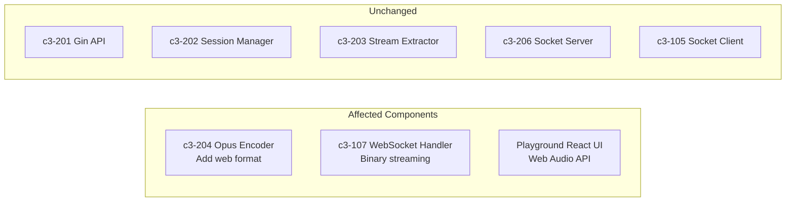
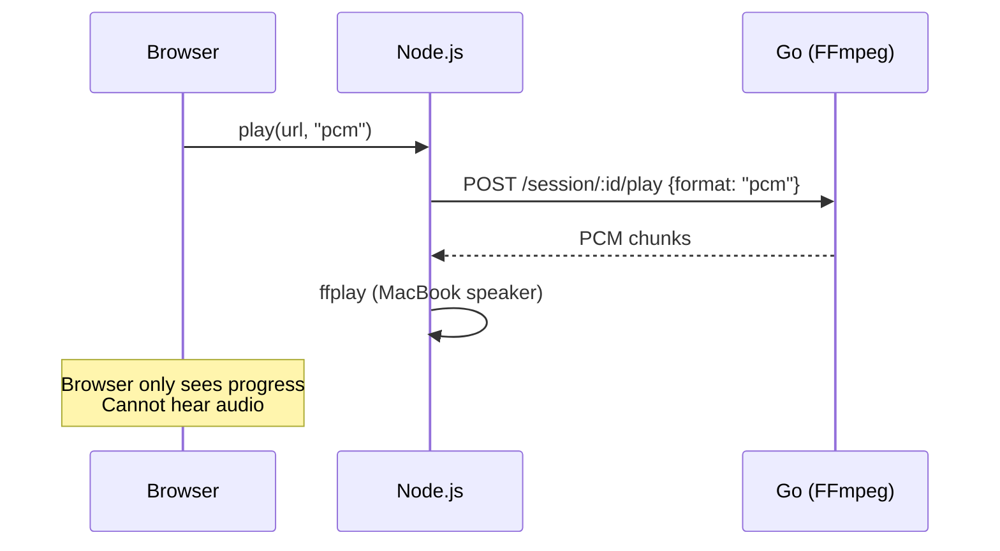
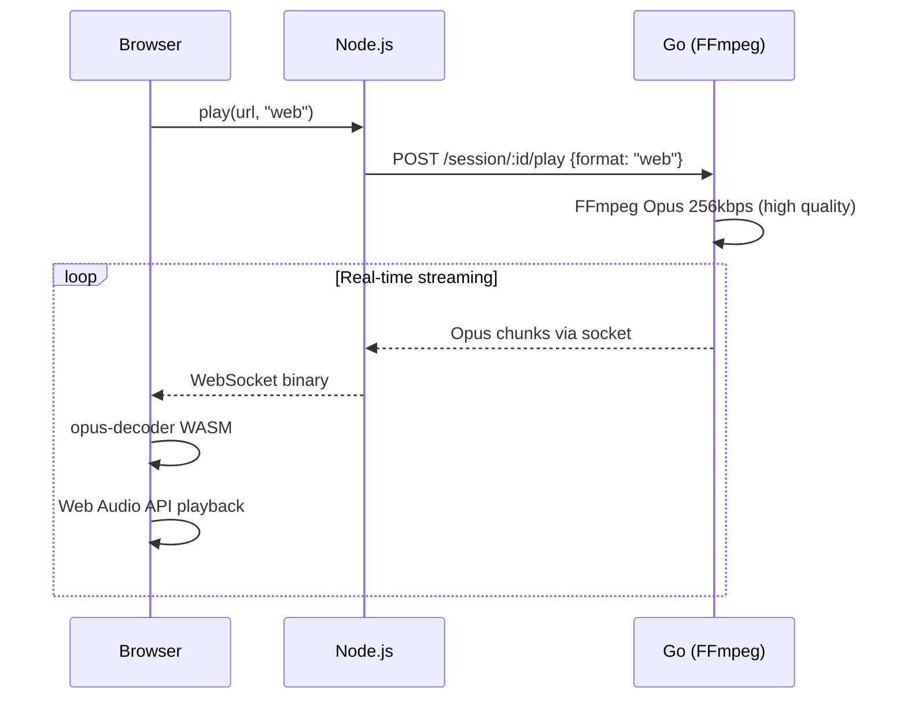
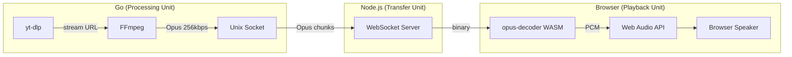

# Story: Stream High-Quality Opus to Web Browser

## Title

Add `task run:web` mode to stream high-quality Opus audio to web browser via WebSocket

## C3 Components Affected



| Component | Layer | Change Type |
|-----------|-------|-------------|
| c3-204 Opus Encoder | Go | Modify (add high-bitrate web format) |
| c3-107 WebSocket Handler | Node.js | Modify (forward Opus binary to browser) |
| Playground UI | React | Modify (add Web Audio API + Opus decoder) |

## User Intent

- **User**: Developer/User playing music via web browser
- **Goal**: Stream YouTube Premium quality audio to web browser in real-time
- **Why**: Enable browser-based playback without MacBook speaker dependency, maintaining highest audio quality

## Current Flow (No Browser Playback)



**Problem:** Browser cannot play audio - only MacBook speakers work via ffplay

## Proposed Solution



**Architecture:**


## Repo Evidence

| File | Line | Evidence |
|------|------|----------|
| `internal/encoder/ffmpeg.go` | 151-161 | Opus format exists (128kbps for Discord) |
| `internal/encoder/types.go` | - | Format enum (FormatPCM, FormatOpus) |
| `app/src/websocket.ts` | 177 | Format hardcoded to "pcm" |
| `playground/src/App.tsx` | - | React UI exists |
| `playground/src/hooks/useWebSocket.ts` | - | WebSocket hook exists |

## Detailed Design

### 1. Go: Add Web Format (c3-204)

```go
// internal/encoder/types.go
const (
    FormatPCM  Format = "pcm"
    FormatOpus Format = "opus"  // Discord: 128kbps
    FormatWeb  Format = "web"   // Browser: 256kbps high quality
)

// internal/encoder/ffmpeg.go
case FormatWeb:
    // High-quality Opus for web browser
    args = append(args,
        "-c:a", "libopus",
        "-b:a", "256000",           // 256kbps (YouTube Premium quality)
        "-vbr", "on",
        "-compression_level", "10",
        "-frame_duration", "20",
        "-application", "audio",
        "-f", "opus",
        "pipe:1",
    )
```

### 2. Node.js: Forward Opus to Browser (c3-107)

```typescript
// app/src/websocket.ts

// Detect web mode from environment
private webMode: boolean;

constructor(server: HttpServer) {
    // ...
    this.webMode = process.env.WEB_AUDIO === '1';
    if (this.webMode) {
        console.log('[WebSocket] Web audio mode enabled via WEB_AUDIO=1');
    }
}

// Select format based on mode (in playTrack)
const format = this.webMode ? 'web' : 'pcm';
await this.apiClient.play(sessionId, url, format);

// Forward audio based on mode
this.socketClient.on('audio', (data: Buffer) => {
    if (this.webMode) {
        // Send binary Opus to browser
        this.broadcastBinary(data);
    } else if (this.debugMode && this.isStreamReady) {
        // PCM to ffplay (existing flow)
        this.audioPlayer.write(data);
    }
});

private broadcastBinary(data: Buffer): void {
    for (const client of this.clients) {
        if (client.readyState === WebSocket.OPEN) {
            client.send(data, { binary: true });
        }
    }
}
```

### 3. Browser: Opus Decoder + Web Audio API with Progress Tracking

```typescript
// playground/src/hooks/useAudioPlayer.ts
import { Decoder } from 'opus-decoder';

interface UseAudioPlayerOptions {
    onProgress?: (seconds: number) => void;
}

export function useAudioPlayer({ onProgress }: UseAudioPlayerOptions = {}) {
    const audioContext = useRef<AudioContext>();
    const decoder = useRef<Decoder>();
    const nextPlayTime = useRef(0);
    const playedSeconds = useRef(0);  // Track playback position for progress bar

    const init = async () => {
        audioContext.current = new AudioContext({ sampleRate: 48000 });
        decoder.current = new Decoder({ sampleRate: 48000, channels: 2 });
        await decoder.current.ready;
        playedSeconds.current = 0;
    };

    const playChunk = (opusData: Uint8Array) => {
        const { channelData, samplesDecoded } = decoder.current.decode(opusData);

        if (samplesDecoded > 0) {
            const buffer = audioContext.current.createBuffer(2, samplesDecoded, 48000);
            buffer.copyToChannel(channelData[0], 0);
            buffer.copyToChannel(channelData[1], 1);

            const source = audioContext.current.createBufferSource();
            source.buffer = buffer;
            source.connect(audioContext.current.destination);

            // Schedule playback
            const now = audioContext.current.currentTime;
            if (nextPlayTime.current < now) {
                nextPlayTime.current = now;
            }
            source.start(nextPlayTime.current);
            nextPlayTime.current += samplesDecoded / 48000;

            // Update progress tracking (accurate based on samples decoded)
            playedSeconds.current += samplesDecoded / 48000;
            onProgress?.(playedSeconds.current);
        }
    };

    const getPlaybackSeconds = () => playedSeconds.current;

    const reset = () => {
        playedSeconds.current = 0;
        nextPlayTime.current = 0;
    };

    return { init, playChunk, getPlaybackSeconds, reset };
}
```

### 4. Browser: WebSocket Binary Handler

```typescript
// playground/src/hooks/useWebSocket.ts

// Handle binary messages (Opus audio)
ws.binaryType = 'arraybuffer';

// Receive webMode from server initial state
const [webMode, setWebMode] = useState(false);

ws.onmessage = (event) => {
    if (event.data instanceof ArrayBuffer) {
        // Binary Opus data (only received in web mode)
        const opusData = new Uint8Array(event.data);
        audioPlayer.playChunk(opusData);
    } else {
        // JSON control message
        const message = JSON.parse(event.data);
        if (message.type === 'state') {
            setWebMode(message.webMode);
            if (message.webMode) {
                audioPlayer.init(); // Initialize decoder
            }
        }
        handleControlMessage(message);
    }
};
```

### 5. Taskfile: Add run:web Task

```yaml
# Taskfile.yml
run:web:
  desc: Start all servers with WEB mode (audio streams to browser)
  cmds:
    - task: kill
    - |
      echo "=== Audio Playground (WEB MODE) ==="
      echo "Audio: Opus 256kbps -> WebSocket -> Browser speakers"
      echo ""
    - |
      set -a
      [ -f app/.env ] && source app/.env
      set +a
      npx concurrently --kill-others --names "Go,Node,Vite" \
        --prefix-colors "cyan,green,magenta" --prefix "[{name}]" \
        "go run cmd/playground/main.go" \
        "cd app && WEB_AUDIO=1 npm run dev" \
        "cd playground && npx vite --clearScreen false"
```

Mode is determined at startup via Taskfile, not a UI toggle:
- `task run:debug` → PCM to MacBook speakers
- `task run:web` → Opus 256kbps to browser
- `task run:bot` → Opus 128kbps to Discord

## Alternatives Considered

1. **MediaSource Extensions (MSE)** - Requires WebM container framing, more complex
2. **WebRTC** - Overkill for single-client streaming
3. **HLS/DASH** - High latency, requires segment files (user explicitly rejected)
4. **PCM over WebSocket** - Large bandwidth, browser can't play raw PCM natively

## Acceptance Criteria

- [ ] New `web` format available in Go API
- [ ] `task run:web` starts servers with `WEB_AUDIO=1`
- [ ] Browser can play audio through its own speakers
- [ ] Audio quality is 256kbps Opus (YouTube Premium quality)
- [ ] Progress bar works correctly (tracks playedSeconds from decoded samples)
- [ ] Pause/Resume works in web mode
- [ ] Skip/Previous works in web mode
- [ ] Progress resets correctly on track change
- [ ] No regression in `task run:debug` (MacBook speaker)
- [ ] No regression in `task run:bot` (Discord Opus 128kbps)

## Implementation Plan

### Go Tasks

- **G1**: Add `FormatWeb` constant in `internal/encoder/types.go`
- **G2**: Add web format FFmpeg args in `internal/encoder/ffmpeg.go` (256kbps Opus)

### Node.js Tasks

- **N1**: Add `webMode` detection from `WEB_AUDIO` env var in `websocket.ts`
- **N2**: Add `broadcastBinary()` method for Opus streaming
- **N3**: Route audio to browser (web mode) or ffplay (debug mode)
- **N4**: Select format based on mode: `web` vs `pcm`

### Browser Tasks

- **B1**: Add `opus-decoder` dependency (`npm install opus-decoder`)
- **B2**: Create `useAudioPlayer` hook with Web Audio API + progress tracking
- **B3**: Update `useWebSocket` to handle binary messages
- **B4**: Receive `webMode` in initial state from Node.js
- **B5**: Initialize audio player only if `webMode === true`
- **B6**: Connect progress callback to UI state for progress bar

### Taskfile Tasks

- **T1**: Add `run:web` task with `WEB_AUDIO=1` environment variable

### Integration Tasks

- **I1**: Test full flow with `task run:web`: browser play → Opus stream → browser audio
- **I2**: Verify `task run:debug` still works (regression test)
- **I3**: Verify `task run:bot` still works (regression test)

## Testing Plan

**Manual QA - Web Mode:**
1. Run `task run:web`
2. Open http://localhost:5173
3. Play a YouTube video
4. Verify:
   - Audio plays through browser speakers (not MacBook)
   - Quality sounds good (256kbps)
   - Progress bar works
   - Pause/Resume works
   - Skip works

**Verify no regression - Debug Mode:**
1. Run `task run:debug`
2. Open http://localhost:5173
3. Play a video
4. Verify audio plays through MacBook speakers

**Verify no regression - Bot Mode:**
1. Run `task run:bot`
2. Use Discord bot to play
3. Verify Opus 128kbps plays in Discord

## Dependencies

- `opus-decoder` npm package (WASM-based Opus decoder)
- Story: "Remove -re flag for PCM" should be completed first (shared PCM progress tracking patterns)

## Risks & Open Questions

**Risks:**
- Browser AudioContext requires user interaction to start (mitigate: init on first play click)
- opus-decoder WASM size (~300KB) (acceptable)
- Scheduling accuracy in Web Audio API (mitigate: use nextPlayTime pattern)

**Open Questions:**
- None remaining

## Out of Scope

- Mobile browser support
- Multiple simultaneous browser clients
- Volume control in browser
- Visualizations / waveform
