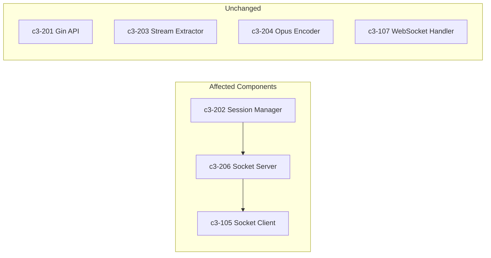
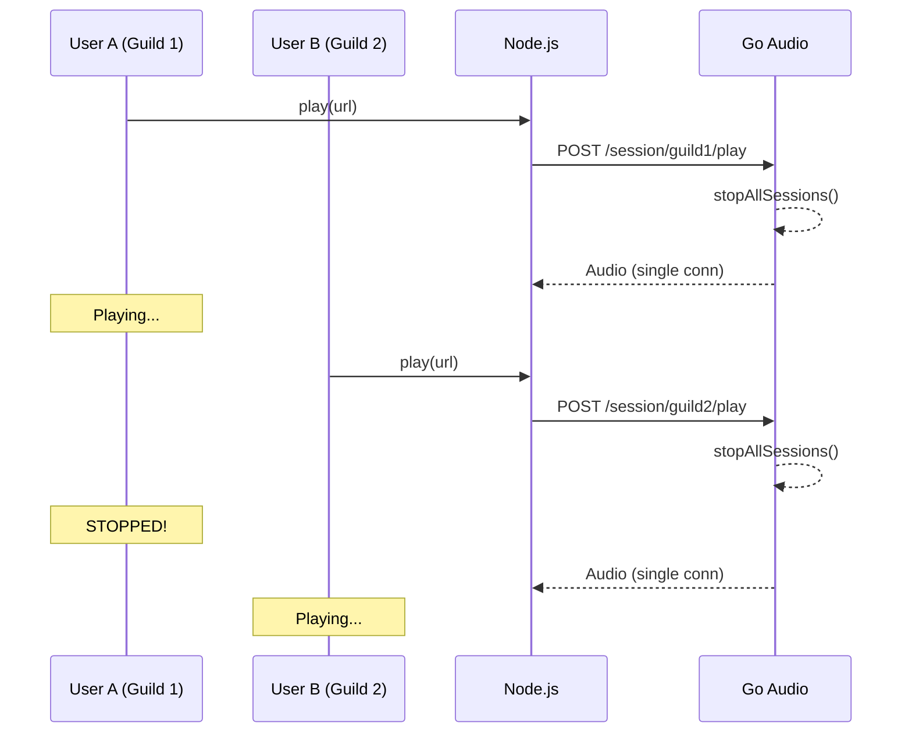
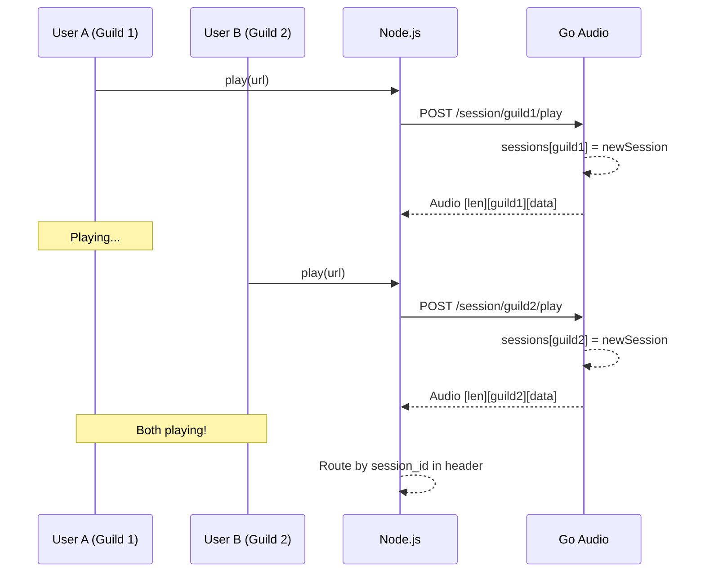

# Concurrent Audio Sessions per Guild/User

## Title

Enable concurrent audio streams - one goroutine per session with session-aware IPC

## C3 Components Affected



| Component | Layer | Change Type |
|-----------|-------|-------------|
| c3-202 Session Manager | Go | Modify |
| c3-206 Socket Server | Go | Modify |
| c3-105 Socket Client | Node.js | Modify |
| c3-201 Gin API | Go | None |
| c3-107 WebSocket Handler | Node.js | None |

## User intent (what user wants)

- **User**: Discord bot operators / Playground users
- **Goal**: Multiple Discord guilds (or playground users) can each play their own audio stream simultaneously without interrupting each other
- **Why now**: Current system stops ALL sessions on every new play request, preventing multi-guild support

## Support needed (what I, the agent, will provide)

- Analyze the current single-session architecture
- Propose solution for concurrent sessions with session-aware audio routing
- Produce implementation tasks for Go and Node.js changes
- Identify risks around audio packet routing and connection management

## How the user uses this (current flow)



- Entry point: WebSocket message `{action: "play", url}` or Discord `/play` command
- Steps:
  1. Node.js calls Go API `POST /session/:id/play`
  2. Go `StartPlayback()` **stops ALL existing sessions** (lines 104-110 in session.go)
  3. Go spawns goroutine for new session
  4. Audio sent via single `net.Conn` (no session identification in packets)
  5. Node.js receives audio, routes to first session with `currentSessionId` set
- Current outputs: Only ONE audio stream active system-wide

## Repo evidence (NO assumptions)

- `internal/server/session.go:104-110` — `StartPlayback` stops all sessions: `for existingID, existing := range m.sessions { existing.Stop() }`
- `internal/server/session.go:66-72` — Single `conn net.Conn` shared by all sessions
- `internal/server/session.go:270-290` — Audio write uses shared `m.GetConnection()` with no session ID in packet
- `internal/server/socket.go:83-88` — `handleConnection` sets single global connection: `s.sessions.SetConnection(conn)`
- `app/src/socket-client.ts:196-201` — Audio packet header is just 4-byte length, no session ID
- `app/src/websocket.ts:182-211` — `handleAudioData` iterates sessions to find matching `currentSessionId` (fragile routing)
- `.c3/c3-2-go-audio/README.md:69` — Documents "Current StartPlayback stops all existing sessions"

## Problem statement (what's wrong / missing)

1. **Single-session enforcement**: `StartPlayback` kills all existing sessions, preventing concurrent playback
2. **No session identification in audio packets**: Go sends `[4-byte length][audio]`, Node.js cannot reliably route to correct session
3. **Single socket connection**: `SessionManager.conn` is a single `net.Conn`, no per-session routing
4. **Fragile audio routing**: Node.js loops through all sessions hoping to find a match

**Who it affects**: Any multi-guild Discord bot deployment, or multiple playground users

## Proposed solution (recommended)



### Behavior changes

1. **Remove "stop all" logic**: Only stop the session with matching ID (if exists), not all sessions
2. **Add session ID to audio packet header**: `[4-byte length][36-byte session_id][audio data]`
3. **Per-session goroutines**: Each session runs independently with its own FFmpeg process
4. **Session-aware routing in Node.js**: Parse session ID from packet header, route to correct session

### Where changes happen

| File | Change |
|------|--------|
| `internal/server/session.go` | Remove stop-all loop, keep per-session goroutine pattern |
| `internal/server/session.go:270-290` | Add session ID to packet header before audio data |
| `app/src/socket-client.ts` | Parse 36-byte session ID from header, emit `audio` event with session ID |
| `app/src/websocket.ts:182-211` | Use session ID from packet to route directly (no loop) |

### Protocol change

**Current packet format:**
```
┌─────────────────────┬─────────────────────┐
│ Length (4 bytes)    │ Audio Data          │
│ Big-endian uint32   │ Variable length     │
└─────────────────────┴─────────────────────┘
```

**New packet format:**
```
┌─────────────────────┬─────────────────────┬─────────────────────┐
│ Length (4 bytes)    │ Session ID (36 b)   │ Audio Data          │
│ Big-endian uint32   │ UUID string         │ Variable length     │
└─────────────────────┴─────────────────────┴─────────────────────┘
```

Note: Length field includes session ID + audio data length.

### Error handling & edge cases

- **Session not found for incoming audio**: Log warning, drop packet (session may have been stopped)
- **Connection lost**: Clear connection, sessions continue buffering until reconnect or timeout
- **Rapid play/stop on same session**: Existing logic handles this via context cancellation

### Backwards compatibility

- **Breaking change**: Node.js and Go must be upgraded together (packet format change)
- No API endpoint changes (still `POST /session/:id/play`)

## Alternatives considered

1. **Multiple Unix sockets (one per session)**
   - Pros: Complete isolation, no multiplexing complexity
   - Cons: File descriptor overhead, Node.js must manage multiple connections, more complex lifecycle

2. **Keep single session, just use guildId**
   - Pros: Minimal change
   - Cons: Doesn't solve the core problem (still only one stream at a time)

3. **WebSocket per session instead of Unix socket**
   - Pros: Built-in framing, works across network
   - Cons: Higher latency, more overhead for local IPC, overkill for same-host communication

## Acceptance criteria (must be testable)

- [ ] When Guild A plays a song, and Guild B plays a different song, both streams play simultaneously
- [ ] When Guild A stops playback, Guild B continues uninterrupted
- [ ] When same guildId sends a new play request, the previous session for that guild stops (not all sessions)
- [ ] Audio quality maintained (48kHz, 20ms frames, no additional latency from routing)
- [ ] Events (`ready`, `finished`, `error`) are routed to correct session
- [ ] Playground users (keyed by userId) can play concurrently with Discord bot (keyed by guildId)

## Implementation plan (tasks)

### Go Tasks

- **Task G1**: Remove "stop all sessions" logic in `StartPlayback`
  - File: `internal/server/session.go:104-110`
  - Change: Only stop session with matching ID, not all sessions
  - C3 Component: c3-202

- **Task G2**: Add session ID to audio packet header
  - File: `internal/server/session.go:275-284`
  - Change: Include 36-byte session ID before audio data in packet
  - C3 Component: c3-202

- **Task G3**: Add session ID to JSON events
  - File: `internal/server/session.go:300-314`
  - Change: Ensure all events include `session_id` (already done, verify)
  - C3 Component: c3-202

### Node.js Tasks

- **Task N1**: Update SocketClient to parse session ID from audio packets
  - File: `app/src/socket-client.ts:196-206`
  - Change: Read 36-byte session ID after length, emit `audio` event with `{sessionId, data}`
  - C3 Component: c3-105

- **Task N2**: Update WebSocketHandler to route audio by session ID
  - File: `app/src/websocket.ts:182-211`
  - Change: Use session ID from packet to find session directly instead of looping
  - C3 Component: c3-105 (consumed by c3-107)

### Integration Tasks

- **Task I1**: Update audio packet format documentation
  - File: `.c3/c3-2-go-audio/README.md:174-189`
  - Change: Document new packet format with session ID

- **Task I2**: End-to-end test with two concurrent sessions
  - Manual test: Open two browser tabs, play different songs, verify both stream simultaneously

## Testing plan

- **Unit tests**:
  - Go: Test `StartPlayback` only stops matching session ID
  - Node.js: Test `SocketClient` parses new packet format correctly

- **Integration/E2E**:
  - Two browser tabs (different users) playing simultaneously
  - Discord bot in Guild A + Playground user playing simultaneously

- **Audio quality verification**:
  - No additional latency from session routing (measure packet arrival times)
  - No audio artifacts from packet parsing changes

- **Manual QA steps**:
  1. Start playback in Tab A (user1)
  2. Start playback in Tab B (user2)
  3. Verify Tab A continues playing
  4. Stop Tab A, verify Tab B continues
  5. Start new song in Tab A, verify Tab B unaffected

## Risks & open questions

**Risks:**
- **Memory usage**: Multiple concurrent FFmpeg processes consume more memory (mitigate: set max concurrent sessions limit)
- **Socket buffer overflow**: Many concurrent streams may overwhelm single Unix socket (monitor: add backpressure if needed)

**Open questions:**
- Should there be a maximum number of concurrent sessions? (Suggest: start without limit, add if needed)
- Should old sessions auto-timeout if no activity? (Suggest: yes, 30 min idle timeout)

## Out of scope

- Jitter buffer improvements (c3-205) - separate story
- Worker pool for session goroutines - future optimization
- Discord bot multi-guild testing - separate integration story
- Session persistence across restarts - separate story
