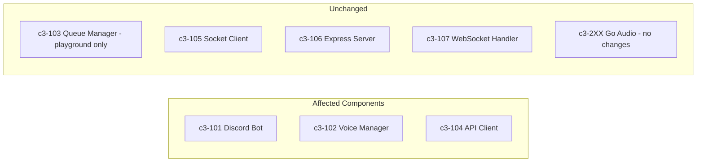
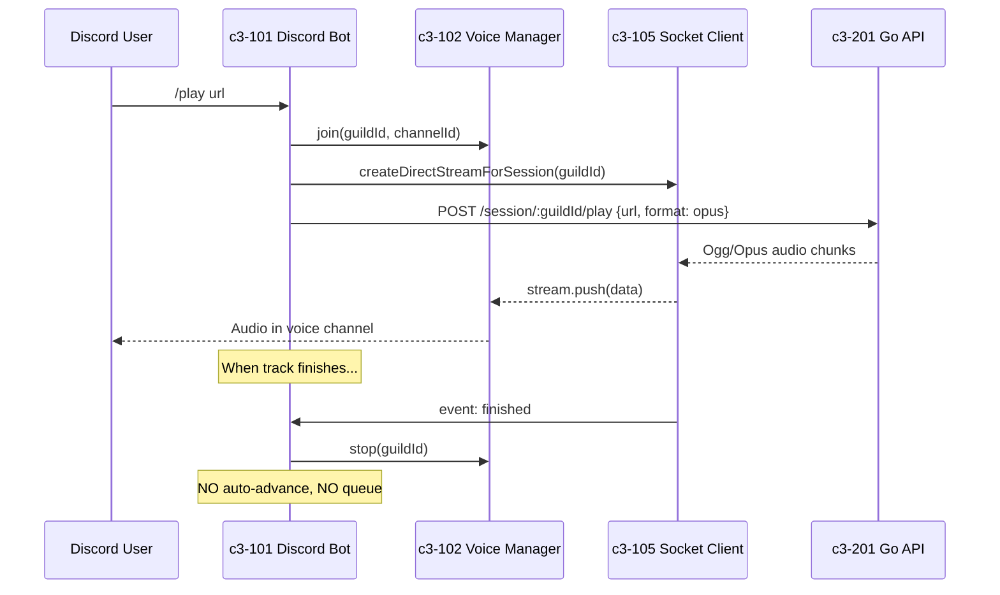
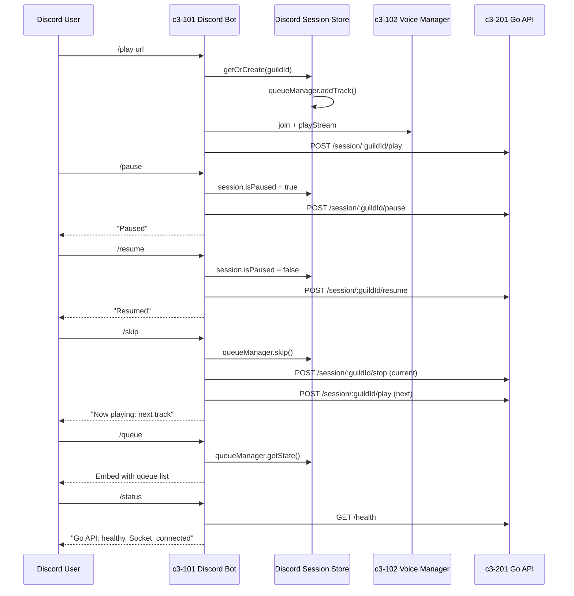

# Add Essential Discord Bot Commands

## C3 Components Affected



| Component | Layer | Change Type |
|-----------|-------|-------------|
| c3-101 Discord Bot | Node.js | Create new commands |
| c3-102 Voice Manager | Node.js | Modify (add pause state) |
| c3-104 API Client | Node.js | None (already has pause/resume) |
| NEW: Discord Session Store | Node.js | Create |

## User Intent

- **User**: Discord server member in voice channel
- **Goal**: Control music playback without using `/play` or `/stop` each time
- **Commands requested**: `/pause`, `/resume`, `/skip`, `/queue`, `/nowplaying`, `/previous`, `/status`

## Support Needed

- Analyze Discord bot flow (NOT web flow)
- Create Discord-specific state management
- Implement slash commands that use existing Go API endpoints
- Will NOT touch: WebSocket handler, web flow, Go audio engine

## How the User Uses This (Current Flow)



**Current limitations:**
1. Only `/play` and `/stop` commands exist
2. No pause/resume - must `/stop` and `/play` again
3. No queue - each `/play` replaces current track
4. No track info display

## Repo Evidence

| File | What it shows |
|------|---------------|
| `app/src/commands/play.ts` | Current /play - no queue, no pause state |
| `app/src/commands/stop.ts` | Current /stop - just stops and leaves |
| `app/src/commands/index.ts` | Only exports play, stop |
| `app/src/voice/manager.ts` | Voice connections only, no playback state |
| `app/src/api-client.ts:71-83` | `pause()` and `resume()` already exist |
| `app/src/queue-manager.ts` | QueueManager class exists (used by web only) |

**Key finding:** The `QueueManager` class exists but is **only used by WebSocket handler** for web sessions. Discord bot has no equivalent.

## Problem Statement

1. Discord bot lacks basic playback controls (pause/resume/skip)
2. No queue management for Discord - users can't add multiple tracks
3. No way to see what's playing or bot health status
4. Each `/play` command interrupts current playback

## Proposed Solution

### Phase 1: Add Discord State Store (NEW)

Create `app/src/discord/session-store.ts` to manage per-guild state:

```typescript
interface GuildSession {
  guildId: string;
  isPaused: boolean;
  currentTrack: Track | null;
  queueManager: QueueManager;
}
```

### Phase 2: Flow with New Commands



## Commands to Implement

### Essential (Phase 1)

| Command | Description | Go API | State Change |
|---------|-------------|--------|--------------|
| `/pause` | Pause current playback | `POST /session/:id/pause` | `isPaused = true` |
| `/resume` | Resume paused playback | `POST /session/:id/resume` | `isPaused = false` |
| `/skip` | Skip to next track in queue | `stop` then `play` next | `queueManager.skip()` |

### Queue (Phase 2)

| Command | Description | Go API | State Change |
|---------|-------------|--------|--------------|
| `/queue` | Show current queue | None | Read `queueManager.getState()` |
| `/nowplaying` | Show current track info | None | Read `queueManager.getCurrentTrack()` |
| `/previous` | Go to previous track | `stop` then `play` prev | `queueManager.previous()` |

### Status (Phase 3)

| Command | Description | Go API |
|---------|-------------|--------|
| `/status` | Show bot health | `GET /health` + socket state |

## Alternatives Considered

### Option A: Extend VoiceManager (NOT recommended)
- Add queue and pause state to `VoiceManager`
- **Con**: Mixes voice connection concerns with playback state
- **Con**: `VoiceManager` is already focused on one thing

### Option B: Create Discord Session Store (Recommended)
- New file `app/src/discord/session-store.ts`
- Similar pattern to web's `SessionStore`
- Reuse existing `QueueManager` class
- **Pro**: Clean separation of concerns
- **Pro**: Consistent with web architecture

### Option C: Share SessionStore with Web
- Use same `SessionStore` for both Discord and Web
- **Con**: Session ID conflict (guildId vs userId)
- **Con**: Different state requirements

## Acceptance Criteria

- [ ] `/pause` pauses playback, responds with confirmation
- [ ] `/resume` resumes paused playback
- [ ] `/pause` when not playing shows error message
- [ ] `/skip` plays next track or shows "no more tracks"
- [ ] `/queue` shows embed with track list (max 10 shown)
- [ ] `/nowplaying` shows current track with thumbnail
- [ ] `/previous` goes back or shows "at start of queue"
- [ ] `/status` shows Go API health and socket connection state
- [ ] No regression: existing `/play` and `/stop` still work
- [ ] Auto-advance: when track finishes, next track plays automatically

## Implementation Plan

### Node.js Tasks

**N1: Create Discord Session Store**
- File: `app/src/discord/session-store.ts`
- Class: `DiscordSessionStore` with `Map<guildId, GuildSession>`
- Reuse `QueueManager` from `queue-manager.ts`
- Methods: `getOrCreate()`, `get()`, `reset()`

**N2: Update /play command**
- File: `app/src/commands/play.ts`
- Add track to queue via session store
- Setup auto-advance on 'finished' event
- Support playlist URLs (like web does)

**N3: Create /pause command**
- File: `app/src/commands/pause.ts`
- Check if playing, call `apiClient.pause()`, update state

**N4: Create /resume command**
- File: `app/src/commands/resume.ts`
- Check if paused, call `apiClient.resume()`, update state

**N5: Create /skip command**
- File: `app/src/commands/skip.ts`
- Get next from queue, stop current, play next

**N6: Create /queue command**
- File: `app/src/commands/queue.ts`
- Build Discord embed with queue list

**N7: Create /nowplaying command**
- File: `app/src/commands/nowplaying.ts`
- Show current track embed with thumbnail

**N8: Create /previous command**
- File: `app/src/commands/previous.ts`
- Get previous from queue, stop current, play previous

**N9: Create /status command**
- File: `app/src/commands/status.ts`
- Call `apiClient.health()`, check socket connection

**N10: Update command registry**
- File: `app/src/commands/index.ts`
- Export all new commands

### Go Tasks

None - Go API already has all required endpoints.

### Integration Tasks

**I1: Test Discord commands end-to-end**
- Verify pause/resume actually pauses Go stream
- Verify skip properly stops and starts new track
- Verify queue displays correctly

## Testing Plan

### Manual QA
1. Join voice channel
2. `/play <youtube-url>` - verify audio plays
3. `/pause` - verify audio stops, bot says "Paused"
4. `/resume` - verify audio resumes
5. `/play <another-url>` - verify adds to queue
6. `/queue` - verify shows both tracks
7. `/skip` - verify plays next track
8. `/previous` - verify goes back
9. `/nowplaying` - verify shows current track info
10. `/status` - verify shows health info
11. Let track finish - verify auto-advances to next

### Edge Cases
- `/pause` when not playing → error message
- `/skip` with empty queue → "No more tracks"
- `/previous` at start → "Already at start"
- `/resume` when not paused → error or no-op

## Risks & Open Questions

### Risks
1. **State sync**: If Go session ends unexpectedly, need to reset Discord state
2. **Multiple guilds**: Ensure state is properly isolated per guild
3. **Memory**: QueueManager per guild - consider cleanup when bot leaves

### Open Questions
1. Should queue persist across bot restarts? (Probably no for Discord - unlike web)
2. Max queue size limit? (Suggest 100 tracks)

## Out of Scope

- Shuffle command (requires new QueueManager method)
- Loop command (requires new QueueManager method)
- Seek command (requires position tracking)
- Volume control (FFmpeg has it, but not exposed)
- Web flow changes - this is Discord bot only
- SQLite persistence for Discord queue (web only)
