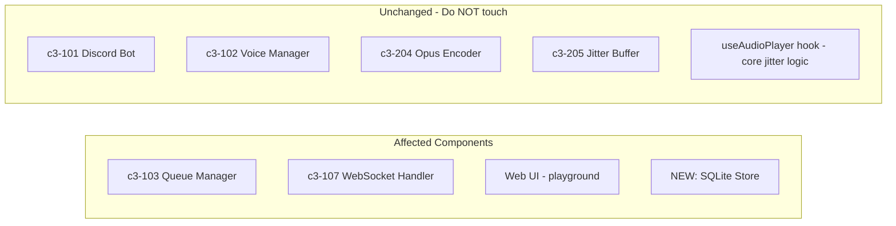
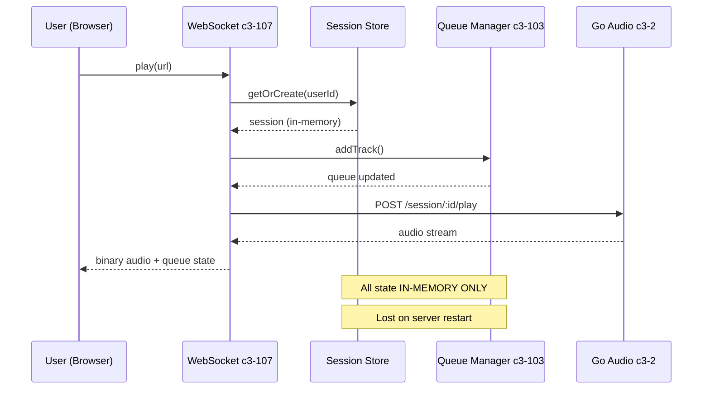
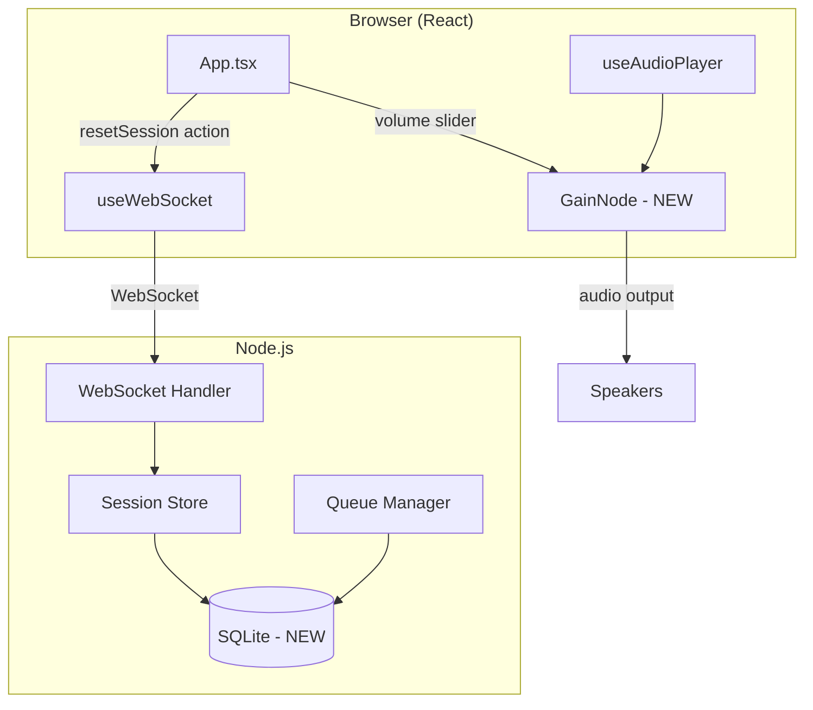
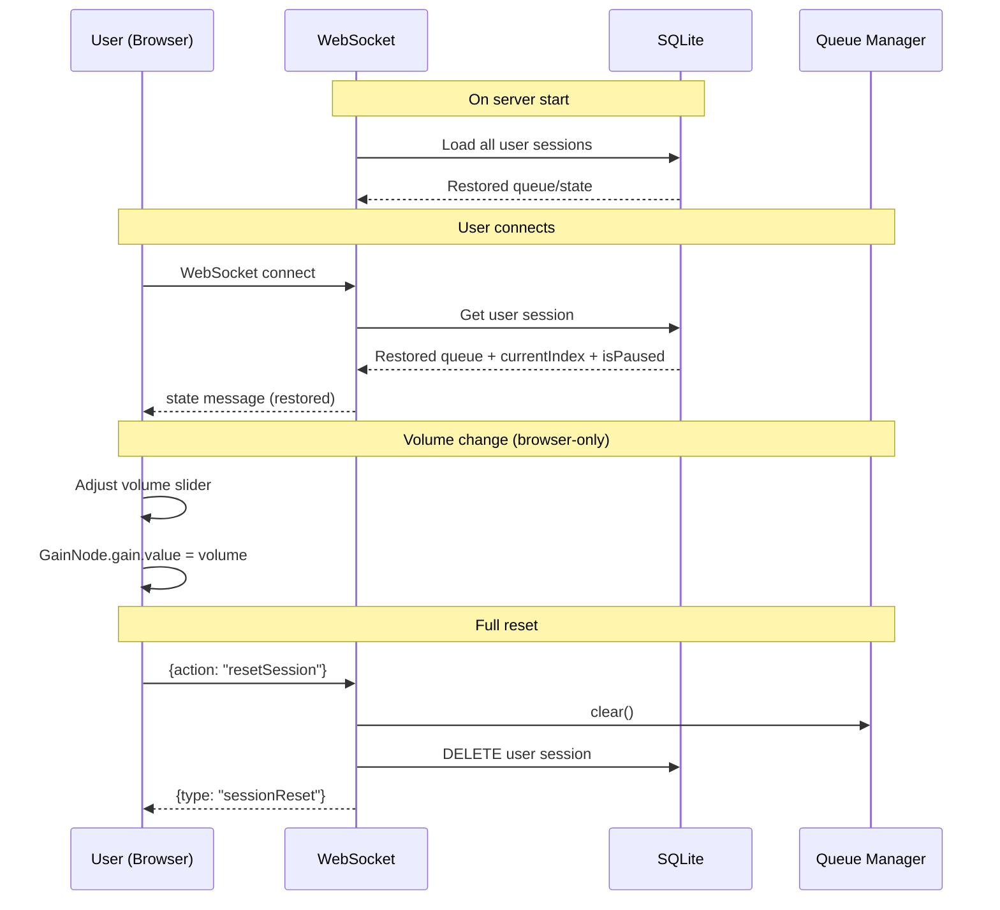

# Web Player Polish: Persistence, Volume, Reset

## Title

Add SQLite persistence, volume control, and full reset to web player

## C3 Components Affected



| Component | Layer | Change Type |
|-----------|-------|-------------|
| c3-103 Queue Manager | Node.js | Modify |
| c3-107 WebSocket Handler | Node.js | Modify |
| Session Store | Node.js | Modify |
| NEW: SQLite Store | Node.js | Create |
| playground/App.tsx | React | Modify |
| useWebSocket.ts | React | Modify |
| useAudioPlayer.ts | React | **NO CHANGE** |

## User intent (what user wants)

- **User**: Web player user (authenticated via Discord OAuth)
- **Goal**: Polish the web player experience with:
  1. **Persistence**: Queue and playback state survives server restart
  2. **Volume control**: Slider in UI to adjust playback volume
  3. **Queue sync**: Remove track from queue on web, affects backend immediately
  4. **Full reset**: Clear all state for current session (queue, playback) without affecting Discord bot
- **Why now**: Web player is functional but lacks these quality-of-life features

## Support needed (what I, the agent, will provide)

- Analyze repo for existing patterns (Done)
- Propose SQLite schema and integration approach
- List implementation tasks with file touch points
- Identify risks and edge cases

## How the user uses this (current flow)



**Current behavior:**
- Entry point: User clicks Play on web UI
- Queue state stored in `QueueManager` class (in-memory)
- Session state stored in `SessionStore` class (in-memory)
- No volume control in UI
- `clearQueue` action exists but doesn't signal "full reset" semantically
- **Problem**: Restart Node.js = all queue/session state gone

## Repo evidence (NO assumptions)

| File | What it shows |
|------|---------------|
| `app/src/queue-manager.ts` | In-memory queue storage, no persistence |
| `app/src/session-store.ts` | In-memory session storage, creates per-user sessions |
| `app/src/websocket.ts:545-556` | `clearQueue` action: stops playback + clears queue |
| `app/src/websocket.ts:521-525` | `removeFromQueue` action: already exists and syncs |
| `playground/src/App.tsx` | No volume slider in UI |
| `playground/src/hooks/useAudioPlayer.ts` | WebAudio pipeline, no GainNode for volume |
| `playground/src/hooks/useWebSocket.ts:546-552` | `removeFromQueue` client-side action exists |

## Problem statement (what's wrong / missing)

1. **No persistence**: Queue and playback state lost when Node.js restarts
2. **No volume control**: Users cannot adjust volume without OS volume control
3. **No "full reset"**: clearQueue works but user wants explicit "reset everything" button
4. **Remove queue sync**: Already works - no changes needed (verified in code)

## Proposed solution (recommended)

### Architecture



### Flow after changes



### Data model (SQLite)

```sql
-- Single table for simplicity
CREATE TABLE user_sessions (
    user_id TEXT PRIMARY KEY,
    username TEXT NOT NULL,
    avatar TEXT,
    queue TEXT NOT NULL,         -- JSON array of tracks
    current_index INTEGER DEFAULT -1,
    is_paused INTEGER DEFAULT 0,
    playback_offset_sec REAL DEFAULT 0,
    updated_at INTEGER DEFAULT (strftime('%s', 'now'))
);
```

### Changes summary

| Area | Change |
|------|--------|
| **Node.js: SQLite Store (NEW)** | Create `app/src/sqlite-store.ts` - wraps better-sqlite3 |
| **Node.js: Session Store** | Load/save sessions from SQLite on start/change |
| **Node.js: Queue Manager** | Emit events when queue changes for persistence |
| **Node.js: WebSocket Handler** | Add `resetSession` action |
| **React: useAudioPlayer** | Add GainNode to audio pipeline for volume |
| **React: useWebSocket** | Add `setVolume` (local) and `resetSession` (server) |
| **React: App.tsx** | Add volume slider + reset button |

### Volume control (browser-only)

```typescript
// In useAudioPlayer.ts - add GainNode
const gainNodeRef = useRef<GainNode | null>(null);

const init = async () => {
  audioContext = new AudioContext({ sampleRate: 48000 });
  gainNodeRef.current = audioContext.createGain();
  gainNodeRef.current.connect(audioContext.destination);
  // ... rest unchanged
};

// When scheduling buffers, connect through gain node
source.connect(gainNodeRef.current!); // Instead of audioContext.destination

// Expose setVolume
const setVolume = (value: number) => {
  if (gainNodeRef.current) {
    gainNodeRef.current.gain.value = Math.max(0, Math.min(1, value));
  }
};
```

## Alternatives considered

### 1. JSON file storage (simpler but fragile)
- **Pros**: Zero dependencies, easy to implement
- **Cons**: No atomic writes, corruption risk, no query support
- **Verdict**: Rejected - SQLite is almost as simple but much more robust

### 2. Volume control server-side (Go FFmpeg)
- **Pros**: Works for all clients consistently
- **Cons**: Requires Go changes, adds latency, CPU cost
- **Verdict**: Rejected - user wants browser-only, this is overkill

### 3. Redis for persistence
- **Pros**: Fast, battle-tested
- **Cons**: External dependency, overkill for single-user playground
- **Verdict**: Rejected - SQLite is zero-config and sufficient

## Acceptance criteria (must be testable)

- [ ] Server restart: Queue state survives and is restored on reconnect
- [ ] Volume slider: Moving slider changes playback volume immediately
- [ ] Volume range: 0% = mute, 100% = full volume, default = 100%
- [ ] Reset button: Clicking "Reset" clears queue, stops playback, resets to initial state
- [ ] Reset isolation: Resetting web session does NOT affect Discord bot sessions
- [ ] Remove queue: Removing track from queue on web immediately updates backend (already works)
- [ ] No regression: Discord bot flow unchanged
- [ ] No regression: Audio quality unchanged (48kHz, 20ms frames)
- [ ] No jitter logic changes: `useAudioPlayer.ts` core buffering unchanged

## Implementation plan (tasks)

### Node.js Tasks

**N1: Create SQLite store module**
- File: `app/src/sqlite-store.ts` (NEW)
- Dependencies: Add `better-sqlite3` to package.json
- Functions: `init()`, `saveSession()`, `loadSession()`, `deleteSession()`, `loadAllSessions()`
- C3: Infrastructure layer (no C3 component)

**N2: Integrate SQLite into SessionStore**
- File: `app/src/session-store.ts`
- Change: Load sessions from DB on startup, save on changes
- Add: `persist()` method that saves to SQLite
- C3: c3-107 (WebSocket Handler uses SessionStore)

**N3: Add persistence hooks to QueueManager**
- File: `app/src/queue-manager.ts`
- Change: Emit `persist` event on any queue change
- SessionStore listens and calls `persist()`
- C3: c3-103

**N4: Add resetSession action to WebSocket**
- File: `app/src/websocket.ts`
- Add handler for `action: "resetSession"`
- Behavior: Clear queue, stop playback, delete from SQLite, send `sessionReset` event
- C3: c3-107

### React Tasks

**R1: Add volume control to useAudioPlayer**
- File: `playground/src/hooks/useAudioPlayer.ts`
- Add: GainNode in init(), setVolume() function
- **DO NOT** change buffering/jitter logic
- Export: `setVolume`, `volume` state

**R2: Add volume and resetSession to useWebSocket**
- File: `playground/src/hooks/useWebSocket.ts`
- Add: `volume` state (local, not sent to server)
- Add: `setVolume(value)` that updates local state and calls audioPlayer.setVolume
- Add: `resetSession()` that sends WebSocket action

**R3: Add volume slider to App.tsx**
- File: `playground/src/App.tsx`
- Add: Volume slider in player controls area
- Style: Match existing Spotify-like design

**R4: Add reset button to App.tsx**
- File: `playground/src/App.tsx`
- Add: "Reset" button near queue header
- Style: Destructive action styling (red tint like existing Trash2 button)
- Confirm dialog: Optional but nice-to-have

## Testing plan

### Unit tests
- SQLite store: `saveSession` + `loadSession` roundtrip
- QueueManager: Verify `persist` event emitted on all changes

### Manual QA checklist
- [ ] Start server, add tracks, restart server → queue restored
- [ ] Adjust volume slider → audio volume changes immediately
- [ ] Volume 0% → muted, 100% → full
- [ ] Click reset → queue clears, playback stops
- [ ] After reset, can add new tracks and play
- [ ] Discord bot unaffected by web reset
- [ ] Remove track from queue → immediately removed on server

### Audio quality verification
- [ ] Compare audio before/after with same video
- [ ] No additional stuttering or artifacts from GainNode

## Risks & open questions

### Risks
1. **SQLite write performance**: Saving on every queue change could be slow for rapid adds. Mitigation: Debounce writes (100ms)
2. **GainNode artifacts**: Changing gain during playback could cause clicks. Mitigation: Use exponentialRampToValueAtTime for smooth transitions
3. **Migration**: First run needs to handle no existing DB. Mitigation: SQLite auto-creates file

### Open questions
- None remaining after clarification

## Out of scope

- Discord bot persistence (bot sessions use guildId, different lifecycle)
- Server-side volume control (Go FFmpeg changes)
- Multiple users sharing queue (each user has own session)
- Seek/scrubbing (different feature)
- Changes to `useAudioPlayer.ts` buffering/jitter logic
- Changes to Go audio pipeline
