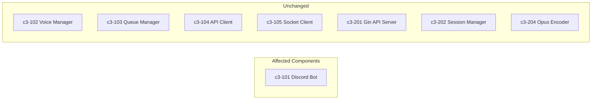
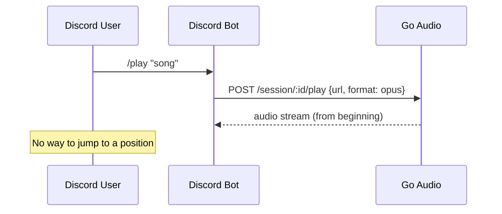
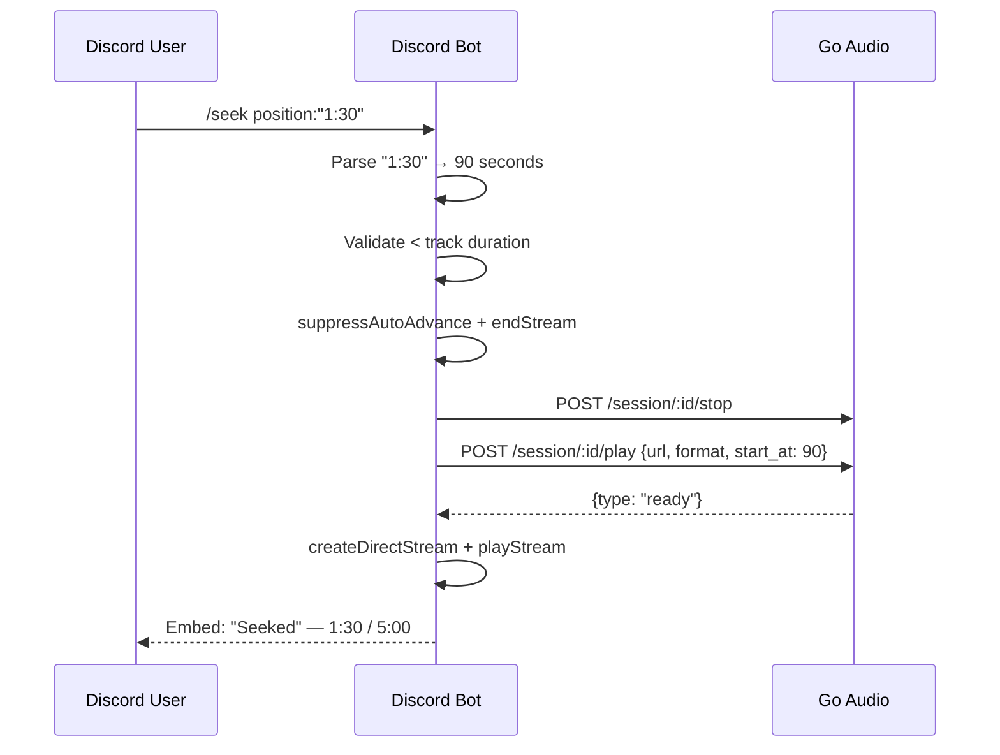

## Add /seek command to Discord bot for jumping to a time position

## C3 Components Affected

| Component | Layer | Change Type |
|-----------|-------|-------------|
| c3-101 Discord Bot | Node.js | Modify (new command) |
| c3-104 API Client | Node.js | None (already has `startAt` param) |
| c3-201 Gin API Server | Go | None (already has `start_at` field) |
| c3-204 Opus Encoder | Go | None (already has `-ss` flag) |

## User intent (what user wants)

- **User**: Discord user listening to music in a voice channel
- **Goal**: Jump to a specific time position in the currently playing track using `/seek`
- **Why now**: Bot is stable with all basic commands; seek is a natural next feature for usability

## Support needed (what I, the agent, will provide)

- Analyze existing command patterns (`/next`, `/jump`) for the stop-replay flow
- Verify Go API already supports `start_at` parameter end-to-end
- Create `/seek` command following established codebase patterns
- Handle edge cases (invalid input, beyond duration, nothing playing, concurrent transitions)

## How the user uses this (current flow)

Currently there is no way to jump to a specific time position. If a user wants to hear a part of a song at 3:00, they must listen from the beginning.

## Repo evidence (NO assumptions)

- `app/src/api-client.ts:71` — `play()` already accepts optional `startAt` parameter
- `app/src/api-client.ts:75` — sends `start_at` in JSON body
- `internal/server/api.go:27` — `PlayRequest.StartAt float64` field exists
- `internal/server/session.go:118` — passes `req.StartAt` to `StartPlayback()`
- `internal/encoder/ffmpeg.go:156-158` — adds `-ss {seconds}` to FFmpeg args when > 0
- `app/src/commands/next.ts` — stop-suppress-play-ready-stream pattern (reference for seek)
- `app/src/discord/session-store.ts` — `isTransitioning`, `suppressAutoAdvanceFor` fields

## Problem statement (what's wrong / missing)

- No `/seek` Discord slash command exists
- Users cannot jump to a specific time position in a playing track
- The Go backend already supports seek via `start_at` but no Discord command uses it

## Proposed solution (recommended)

- **New file**: `app/src/commands/seek.ts` — follows `next.ts` pattern exactly
- **Modified file**: `app/src/commands/index.ts` — add seek to commands array
- **Input formats**: seconds (`90`), MM:SS (`1:30`), HH:MM:SS (`1:02:30`)
- **No protocol changes** — uses existing `start_at` parameter
- **No Go changes** — FFmpeg `-ss` already implemented

## Alternatives considered

1. **Modify `playTrack()` in play.ts to accept startAt** — would DRY up the code but couples seek with the shared helper that other flows depend on. Following the codebase convention where each command (next, previous, jump) inlines the flow is safer.
2. **Add a dedicated `/session/:id/seek` Go endpoint** — unnecessary since restarting with `start_at` achieves the same result and the Go side already supports it.

## Acceptance criteria (must be testable)

- [x] `/seek 90` jumps to 1:30 in the current track
- [x] `/seek 1:30` same result via MM:SS format
- [x] `/seek 1:02:30` works for HH:MM:SS format
- [x] `/seek 0` restarts from beginning
- [x] `/seek abc` returns error with usage hint
- [x] `/seek` beyond duration returns error
- [x] `/seek` with nothing playing returns "Nothing is playing"
- [x] After seek, auto-advance to next track still works
- [x] Rapid seeks blocked by `isTransitioning` lock
- [x] No regression in existing commands

## Implementation plan (tasks)

### Node.js Tasks
- Task N1: Create `app/src/commands/seek.ts` with `parseTimePosition()`, `formatDuration()`, and `execute()` — c3-101
- Task N2: Add seek import and registration in `app/src/commands/index.ts` — c3-101

### Go Tasks
- None required

### Integration Tasks
- Task I1: Verify TypeScript compilation with `tsc --noEmit`

## Testing plan

- **Manual QA**: Test all input formats (seconds, MM:SS, HH:MM:SS) in Discord
- **Edge cases**: invalid input, beyond duration, nothing playing, concurrent seeks
- **Regression**: verify /next, /previous, /play still work after adding seek
- **Audio quality**: verify seeked audio plays smoothly (48kHz, 20ms frames)

## Risks & open questions

- **Risk**: FFmpeg `-ss` with network streams may not be frame-accurate (may start a few seconds earlier/later). This is acceptable for a music bot.
- **Risk**: Re-extracting the stream URL on seek adds ~2-3s latency (yt-dlp runs again). Acceptable tradeoff.

## Out of scope

- Progress bar / elapsed time tracking in Discord embeds
- Seek via web playground UI
- Seek slider/buttons (only text input)
- Caching stream URLs to avoid re-extraction on seek
